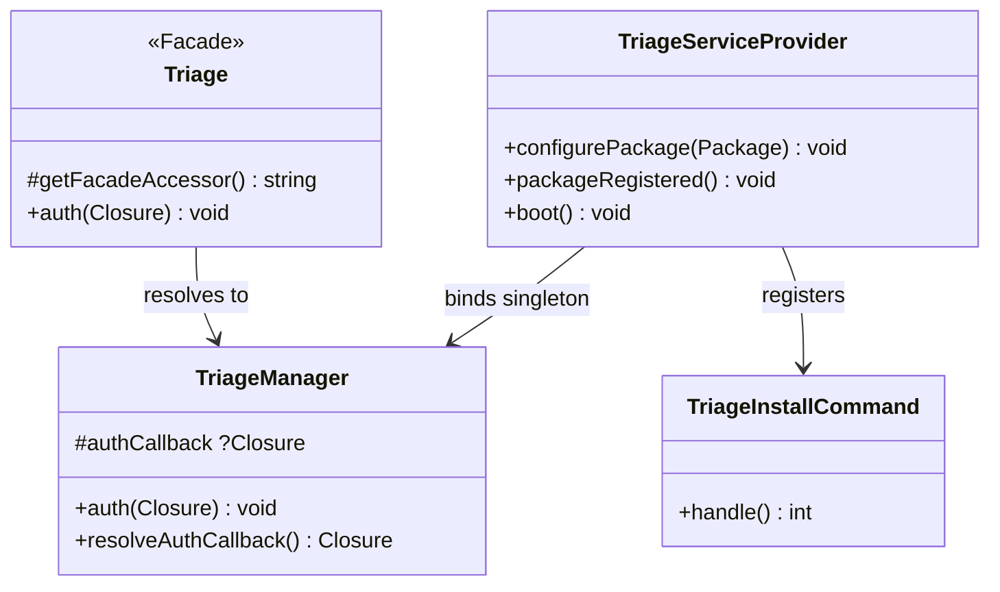

# Plan v1 — Phase 1: Package Foundation & Configuration

I have created the following plan after thorough exploration and analysis of the codebase. Follow the below plan verbatim. Trust the files and references. Do not re-verify what's written in the plan. Explore only when absolutely necessary. First implement all the proposed file changes and then I'll review all the changes together at the end.

---

## Observations

The codebase is a fresh Spatie Laravel Package Tools skeleton. Every file uses `VendorName\Skeleton` as the namespace and `skeleton` as the package slug. The service provider extends `PackageServiceProvider` and registers config, views, a stub migration, and one command. The facade resolves to the `Skeleton` class (currently empty). Pint is configured with the `laravel` preset enforcing `final_class`, `declare_strict_types`, and `ordered_class_elements`. Pest 4 is the test runner with Orchestra Testbench; the `TestCase` base class registers the skeleton service provider and sets up factory guessing. PHP 8.4 is the minimum version. The package must support both Laravel 11.x and 12.x.

---

## Approach

This phase transforms the skeleton into the Triage package shell. Every placeholder name is replaced with Triage-specific values. The config file is populated with all keys from the PRD. The service provider is extended to register migrations, routes, views, and publishable assets. A `TriageManager` shell is created and bound to the Triage facade. A Horizon-style gate callback (`Triage::auth()`) governs dashboard access — denying by default in production. The `triage:install` artisan command handles first-run setup. No business logic or data layer exists yet; this phase only establishes the package skeleton that all subsequent phases build upon.

---

## - [ ] 1. Package Rename

Rename all skeleton references to Triage. This touches every file in the project.

| From | To |
|---|---|
| Namespace `VendorName\Skeleton` | `HotReloadStudios\Triage` |
| Namespace `VendorName\Skeleton\Tests` | `HotReloadStudios\Triage\Tests` |
| Namespace `VendorName\Skeleton\Database\Factories` | `HotReloadStudios\Triage\Database\Factories` |
| Composer name `vendor-name/package-skeleton` | `hotreloadstudios/triage` |
| Facade alias `Skeleton` | `Triage` |
| Service provider class `SkeletonServiceProvider` | `TriageServiceProvider` |
| Facade class `Skeleton` | `Triage` |
| Manager class `Skeleton` | `TriageManager` |
| Command class `SkeletonCommand` | Remove (replaced in section 6) |
| Config file `config/skeleton.php` | `config/triage.php` |
| Package slug `skeleton` | `triage` |

**Files requiring rename/move:**

| Current Path | New Path |
|---|---|
| `src/Skeleton.php` | `src/TriageManager.php` |
| `src/SkeletonServiceProvider.php` | `src/TriageServiceProvider.php` |
| `src/Facades/Skeleton.php` | `src/Facades/Triage.php` |
| `src/Commands/SkeletonCommand.php` | Remove (replaced by `triage:install`) |
| `config/skeleton.php` | `config/triage.php` |

**Files requiring namespace/reference updates (no path change):**

- `composer.json` — autoload PSR-4 keys, extra providers/aliases, package name, description, keywords
- `tests/TestCase.php` — namespace, provider reference
- `tests/Pest.php` — use statement
- `tests/ExampleTest.php` — namespace declaration
- `tests/ArchTest.php` — namespace declaration
- `database/factories/ModelFactory.php` — namespace declaration
- `phpunit.xml.dist` — test suite name

Update `composer.json` autoload:

```
"autoload": {
    "psr-4": {
        "HotReloadStudios\\Triage\\": "src/",
        "HotReloadStudios\\Triage\\Database\\Factories\\": "database/factories/"
    }
},
"autoload-dev": {
    "psr-4": {
        "HotReloadStudios\\Triage\\Tests\\": "tests/",
        "Workbench\\App\\": "workbench/app/"
    }
}
```

Update `composer.json` extra:

```
"extra": {
    "laravel": {
        "providers": [
            "HotReloadStudios\\Triage\\TriageServiceProvider"
        ],
        "aliases": {
            "Triage": "HotReloadStudios\\Triage\\Facades\\Triage"
        }
    }
}
```

After renaming, run `composer dump-autoload` and `composer test` to verify nothing is broken.

---

## - [ ] 2. Configuration File

**`config/triage.php`**

Define all configuration keys from the PRD. Each key has a sensible default so Triage works without any config changes for basic usage.

| Key | Type | Default | Description |
|---|---|---|---|
| `path` | `string` | `'triage'` | URL prefix for the dashboard routes |
| `middleware` | `array` | `['web']` | Middleware stack applied to all dashboard routes |
| `mailbox_address` | `?string` | `null` | Inbound email address (used by Laravel Mailbox). Null disables inbound email processing. |
| `reply_to_address` | `?string` | `null` | Base reply-to address for token threading (e.g., `support@example.com`). Plus-addressing is used to embed tokens. |
| `from_name` | `string` | `config('app.name')` | Sender name for outbound ticket emails |
| `from_address` | `string` | `config('mail.from.address')` | Sender address for outbound ticket emails |
| `user_model` | `string` | `'App\\Models\\User'` | FQCN of the host application's User model. Used for agent identity and submitter matching. |

All values are string, array, or null. No closures in config (closures cannot be cached).

---

## - [ ] 3. Service Provider

**`src/TriageServiceProvider.php`**

Extends `Spatie\LaravelPackageTools\PackageServiceProvider`.

`configurePackage(Package $package): void`:
1. Set name to `'triage'`
2. Register config file via `hasConfigFile()`
3. Register views via `hasViews()` — the blade shell view for the SPA lives in `resources/views/`
4. Register route file via `hasRoutes('web')` using the empty stub created in section 7 so the package already has a valid route file during boot
5. Do NOT register package migrations yet. Add `hasMigrations()` in Phase 2 once the real migration stubs exist.
6. Register the install command via `hasInstallCommand()` using Spatie's built-in install support

`packageRegistered(): void`:
1. Bind `TriageManager` as a singleton in the container: `$this->app->singleton(TriageManager::class)`

`boot(): void`:
1. Call `parent::boot()`
2. Register publishable assets: publish the `resources/dist/` directory to `public/vendor/triage/` under the tag `triage-assets`
3. Register the gate: resolve the stored auth callback and define a gate named `triage` that delegates to it

The service provider does NOT register middleware globally. Middleware is applied to the route group only (Phase 5).

---

## - [ ] 4. Facade & TriageManager Shell

**`src/Facades/Triage.php`**

- Extends `Illuminate\Support\Facades\Facade`
- `getFacadeAccessor(): string` returns `\HotReloadStudios\Triage\TriageManager::class`
- Add a PHPDoc block with `@see \HotReloadStudios\Triage\TriageManager`
- Add a static method `auth(Closure $callback): void` that stores the callback on the manager instance for gate registration

**`src/TriageManager.php`**

Shell class with no business logic yet (SDK methods arrive in Phase 3). This phase establishes:

- A `protected ?Closure $authCallback` property defaulting to `null`
- `auth(Closure $callback): void` — stores the gate callback
- `resolveAuthCallback(): Closure` — returns the stored callback, or a default closure that checks `app()->environment('local', 'testing')` and returns `true` in those environments, `false` otherwise

No other public methods. Phase 3 adds all SDK methods.

---

## - [ ] 5. Gate / Authorization

Triage uses the same pattern as Laravel Horizon for access control.

**How it works:**

1. The consuming application calls `Triage::auth(fn (User $user): bool => $user->isAdmin())` inside its `AppServiceProvider::boot()` method
2. This stores the closure on `TriageManager`
3. The `TriageServiceProvider::boot()` method registers a Laravel gate named `'triage'` that invokes `$triageManager->resolveAuthCallback()`
4. All dashboard routes are protected by this gate (via middleware in Phase 5)

**Default behavior (no `Triage::auth()` call):**
- `local` and `testing` environments: gate returns `true` (allow access)
- All other environments (production, staging): gate returns `false` (deny access)

This ensures the dashboard is locked down by default in production, matching Horizon's security posture.

The gate is a standard Laravel gate definition; it receives the authenticated `User` model as its first argument. If no user is authenticated, the gate denies access automatically.

---

## - [ ] 6. Install Command

**`src/Commands/TriageInstallCommand.php`**

Artisan command registered as `triage:install`. Uses Spatie's `InstallCommand` if the package tools version supports it, otherwise a manual `Command` implementation.

**Signature:** `triage:install`

**Steps executed by `handle(): int`:**

1. Display a welcome banner: `Triage — Installing...`
2. Publish the config file — call `$this->call('vendor:publish', ['--tag' => 'triage-config'])`
3. Publish migrations — call `$this->call('vendor:publish', ['--tag' => 'triage-migrations'])`
4. Run migrations — call `$this->call('migrate')`
5. Publish compiled assets — call `$this->call('vendor:publish', ['--tag' => 'triage-assets', '--force' => true])`
6. Check mailbox-specific configuration prerequisites — if `triage.mailbox_address` or `triage.reply_to_address` are empty, display a non-blocking message that inbound email remains disabled until mailbox/provider setup is completed. By the end of Phase 4 Laravel Mailbox is a dependency, so the install command should guide configuration rather than treat the dependency itself as optional.
7. Remind the user to add `Triage::auth()` callback for production: display info message with example
8. Display success: `Triage installed successfully.`
9. Return `self::SUCCESS`

The command is idempotent: running it multiple times does not create duplicate config or migrations (Artisan publish checks for existing files).

---

## - [ ] 7. Create Route File Stub

**`routes/web.php`**

Create an empty route file that Phase 5 will populate. For now, it contains only a comment placeholder and no route definitions. This prevents the service provider's `hasRoutes('web')` from erroring.

The file should be a standard Laravel route file; it does not return a closure. Phase 5 fills in the actual routes.

---

## - [ ] 8. Create Empty Asset Directories

Create the directory structure for compiled frontend assets and the Blade shell view:

- `resources/dist/` — empty directory where pre-compiled JS/CSS will live (Phase 6)
- `resources/views/app.blade.php` — a minimal Blade shell template that Phase 6 will flesh out. For now, it renders a placeholder HTML page with a `<div id="app"></div>` and a message indicating the SPA assets need to be published.

This ensures the service provider's `hasViews()` and asset publishing work immediately.

---

## - [ ] 9. Tests

### Unit Tests

**`tests/Unit/TriageManagerTest.php`**

- `it stores an auth callback` — call `auth()` with a closure, then call `resolveAuthCallback()` and assert the returned closure is the one that was stored
- `it returns a default auth callback when none is set` — call `resolveAuthCallback()` without setting one; assert a closure is returned
- `it allows access in local environment by default` — set app environment to `local`, invoke the default callback, assert it returns `true`
- `it denies access in production environment by default` — set app environment to `production`, invoke the default callback, assert it returns `false`

### Feature Tests

**`tests/Feature/ServiceProviderTest.php`**

- `it registers the service provider` — assert `TriageServiceProvider` is in the app's loaded providers
- `it binds triage manager as singleton` — resolve `TriageManager` twice from the container and assert same instance
- `it registers the triage gate` — assert the `triage` gate is defined (use `Gate::has('triage')`)

**`tests/Feature/InstallCommandTest.php`**

- `it runs the install command successfully` — call `artisan('triage:install')` and assert exit code 0
- `it publishes the config file` — run the install command and assert `config/triage.php` was published
- `it displays mailbox configuration guidance when inbound email settings are incomplete` — run the install command and assert the output explains that mailbox/provider setup still needs to be completed

**`tests/Feature/ConfigTest.php`**

- `it has all expected config keys` — assert `config('triage.path')` returns `'triage'`, `config('triage.middleware')` returns `['web']`, and all other keys exist with their defaults
- `it resolves the user model config` — assert `config('triage.user_model')` returns `'App\\Models\\User'`

---

## Data Model Diagram

No data models introduced in this phase. The TriageManager and gate system are the key components:


