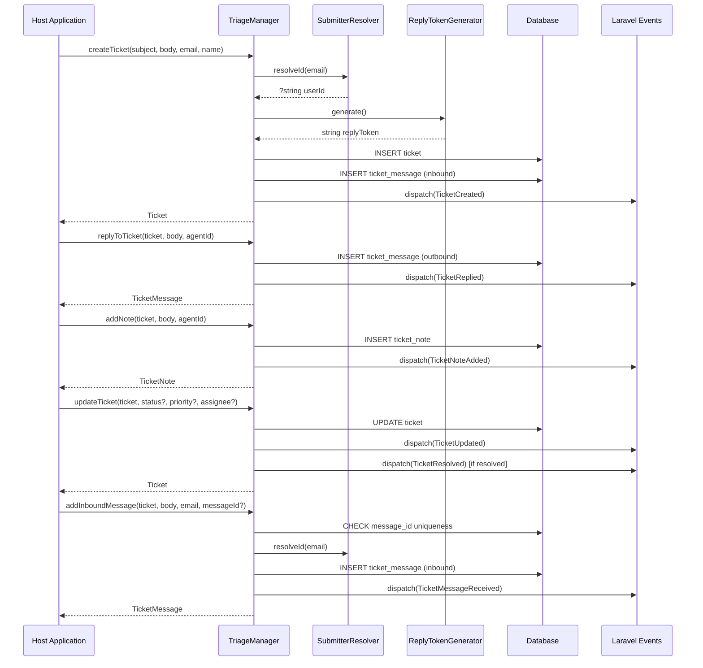

# Plan v1 — Phase 3: Core SDK & Events

I have created the following plan after thorough exploration and analysis of the codebase. Follow the below plan verbatim. Trust the files and references. Do not re-verify what's written in the plan. Explore only when absolutely necessary. First implement all the proposed file changes and then I'll review all the changes together at the end.

---

## Observations

Phase 1 established the Triage package shell: `HotReloadStudios\Triage` namespace, `TriageServiceProvider`, `TriageManager` singleton with gate callback support, `Triage` facade, config file, and install command. Phase 2 built the complete data layer: three string-backed enums (`TicketStatus`, `TicketPriority`, `MessageDirection`), three UUID-keyed models (`Ticket`, `TicketMessage`, `TicketNote`) with relationships, scopes, and casts, three migration stubs, and three factories with named states. The `TriageManager` currently has only the `auth()` and `resolveAuthCallback()` methods — this phase fills it with all SDK methods. User references are stored as strings and resolved via `config('triage.user_model')`.

---

## Approach

This phase implements the core SDK — the `TriageManager` class that exposes every ticket operation as a fluent public method. Per the PRD's "SDK-first" principle, the dashboard (Phase 5) is a consumer of this same SDK; no logic lives in controllers that isn't accessible here. Each SDK method dispatches a corresponding Laravel event so host applications can hook into the ticket lifecycle. A dedicated `SubmitterResolver` service handles looking up the host app's User model by email (or gracefully storing guest info when no match exists). Reply tokens are generated using `random_bytes(16)` (128-bit) encoded as hex. All SDK methods are tested against the database using factories from Phase 2.

---

## - [ ] 1. Events

Create seven event classes in `src/Events/`. Each event is a simple data class (no `ShouldBroadcast` — MVP has no real-time features). All events are `final`, use constructor property promotion, and implement `Illuminate\Foundation\Events\Dispatchable`.

**`src/Events/TicketCreated.php`**

- Constructor: `public function __construct(public readonly Ticket $ticket)`
- Dispatched when a new ticket is created via any path (SDK, inbound email, dashboard)

**`src/Events/TicketReplied.php`**

- Constructor: `public function __construct(public readonly Ticket $ticket, public readonly TicketMessage $message)`
- Dispatched when an agent sends an outbound reply

**`src/Events/TicketMessageReceived.php`**

- Constructor: `public function __construct(public readonly Ticket $ticket, public readonly TicketMessage $message)`
- Dispatched when an inbound customer message is appended to a ticket thread

**`src/Events/TicketNoteAdded.php`**

- Constructor: `public function __construct(public readonly Ticket $ticket, public readonly TicketNote $note)`
- Dispatched when an internal note is added

**`src/Events/TicketUpdated.php`**

- Constructor: `public function __construct(public readonly Ticket $ticket, public readonly array $changes)`
- `$changes` is an associative array of what changed (e.g., `['status' => ['old' => 'open', 'new' => 'resolved'], 'assignee_id' => ['old' => null, 'new' => '01HX...']]`)
- Dispatched when status, priority, or assignee changes

**`src/Events/TicketResolved.php`**

- Constructor: `public function __construct(public readonly Ticket $ticket)`
- Dispatched when a ticket moves to `Resolved` status (in addition to `TicketUpdated`)

**`src/Events/TicketClosed.php`**

- Constructor: `public function __construct(public readonly Ticket $ticket)`
- Dispatched when a ticket moves to `Closed` status (in addition to `TicketUpdated`)

---

## - [ ] 2. Submitter Resolver

**`src/Support/SubmitterResolver.php`**

A `final` class responsible for looking up a host application user by email.

**Method: `resolve(string $email): ?Model`**

1. Read `config('triage.user_model')` to get the FQCN of the host User model
2. Query the model: `$model::where('email', $email)->first()`
3. Return the user instance if found, `null` otherwise

**Method: `resolveId(string $email): ?string`**

1. Call `resolve($email)` to get the user
2. If user exists, return `(string) $user->getKey()` — cast to string for storage compatibility
3. If null, return `null`

This class is registered in the container as a singleton by `TriageServiceProvider::packageRegistered()`.

The class does NOT create users. If the email doesn't match an existing host user, the ticket stores `submitter_id = null` with the name and email as plain strings (guest submitter).

---

## - [ ] 3. Reply Token Generator

**`src/Support/ReplyTokenGenerator.php`**

A `final` class that generates cryptographically random tokens for reply-to email threading.

**Method: `generate(): string`**

1. Generate 16 random bytes using `random_bytes(16)` (128-bit)
2. Encode as hexadecimal via `bin2hex()` — produces a 32-character string
3. Return the hex string

The token is stored on the `tickets.reply_token` column (unique constraint). It is embedded in outbound email reply-to addresses as `support+triage-{token}@example.com` (Phase 4 handles the email formatting).

This class is stateless and does not need to be a singleton; it can be newed up directly or resolved from the container.

---

## - [ ] 4. TriageManager SDK Methods

**`src/TriageManager.php`**

Expand the existing `TriageManager` class (from Phase 1) with all SDK methods. The manager receives `SubmitterResolver` and `ReplyTokenGenerator` via constructor injection.

**Constructor:**

`public function __construct(private readonly SubmitterResolver $submitterResolver, private readonly ReplyTokenGenerator $replyTokenGenerator)`

Update the `TriageServiceProvider` singleton binding to resolve these two dependencies automatically (Laravel's container handles this via auto-injection).

Keep the existing `$authCallback` property and `auth()`/`resolveAuthCallback()` methods from Phase 1.

Add one internal helper so the public SDK matches the PRD examples while persistence remains string-based:

`private function resolveUserId(Model|string|null $user): ?string`

- If `$user` is a model instance, return `(string) $user->getKey()`
- If `$user` is a non-empty string, return it unchanged
- If `$user` is `null`, return `null`

---

### Method: `createTicket`

**Signature:**

```
public function createTicket(
    string $subject,
    string $body,
    string $submitterEmail,
    string $submitterName,
    TicketPriority $priority = TicketPriority::Normal,
    ?string $assigneeId = null,
): Ticket
```

**Logic flow:**

1. Resolve the submitter ID: call `$this->submitterResolver->resolveId($submitterEmail)` to look up the host user
2. Generate a reply token: call `$this->replyTokenGenerator->generate()`
3. Create the `Ticket` record with:
   - `subject` from parameter
   - `status` → `TicketStatus::Open`
   - `priority` from parameter (defaults to Normal)
   - `submitter_id` from resolver (may be null)
   - `submitter_name` from parameter
   - `submitter_email` from parameter
   - `assignee_id` from parameter (may be null)
   - `reply_token` from generator
4. Create the initial `TicketMessage` record on the ticket:
   - `direction` → `MessageDirection::Inbound`
   - `author_id` → the resolved submitter ID (may be null)
   - `body` from the `$body` parameter
   - `message_id` → null (not from email)
   - `raw_email` → null
5. Dispatch `TicketCreated` event with the ticket
6. Return the created `Ticket` (with messages eager-loaded)

---

### Method: `replyToTicket`

**Signature:**

```
public function replyToTicket(
    Ticket $ticket,
    string $body,
    Model|string $agent,
): TicketMessage
```

**Logic flow:**

1. Create a `TicketMessage` record on the ticket:
   - `direction` → `MessageDirection::Outbound`
    - `author_id` → `$this->resolveUserId($agent)`
   - `body` from parameter
   - `message_id` → null (outbound messages don't have email Message-IDs at creation)
   - `raw_email` → null
2. If the ticket's status is `Resolved` or `Closed`, do NOT change it (agent reply doesn't reopen)
3. Dispatch `TicketReplied` event with the ticket and message
4. Return the created `TicketMessage`

Note: Phase 4 adds email sending. This method only creates the database record and fires the event. The email is triggered by a listener on `TicketReplied`.

---

### Method: `addNote`

**Signature:**

```
public function addNote(
    Ticket $ticket,
    string $body,
    Model|string $agent,
): TicketNote
```

**Logic flow:**

1. Create a `TicketNote` record on the ticket:
    - `author_id` → `$this->resolveUserId($agent)`
   - `body` from parameter
2. Dispatch `TicketNoteAdded` event with the ticket and note
3. Return the created `TicketNote`

---

### Method: `updateTicket`

**Signature:**

```
public function updateTicket(
    Ticket $ticket,
    ?TicketStatus $status = null,
    ?TicketPriority $priority = null,
    Model|string|null $assignee = null,
): Ticket
```

**Logic flow:**

1. Collect changes: build an associative array of `['field' => ['old' => ..., 'new' => ...]]` for each non-null parameter that differs from the current value. Normalize the assignee with `resolveUserId()` before comparing or persisting.
2. If no changes, return the ticket unchanged
3. Apply updates to the ticket model and save
4. Dispatch `TicketUpdated` event with the ticket and changes array
5. If the new status is `Resolved`, additionally dispatch `TicketResolved` event
6. If the new status is `Closed`, additionally dispatch `TicketClosed` event
7. Return the freshly-loaded `Ticket`

For MVP, `null` means "leave the current assignee unchanged". Explicit unassignment is not part of the current SDK surface and should only be added when the product requirements call for it.

---

### Method: `assignTicket`

**Signature:**

```
public function assignTicket(Ticket $ticket, Model|string $agent): Ticket
```

**Logic flow:**

1. Delegate to `updateTicket($ticket, assignee: $agent)`
2. Return the result

This is a convenience wrapper around `updateTicket`.

---

### Method: `resolveTicket`

**Signature:**

```
public function resolveTicket(Ticket $ticket): Ticket
```

**Logic flow:**

1. Delegate to `updateTicket($ticket, status: TicketStatus::Resolved)`
2. Return the result

---

### Method: `closeTicket`

**Signature:**

```
public function closeTicket(Ticket $ticket): Ticket
```

**Logic flow:**

1. Delegate to `updateTicket($ticket, status: TicketStatus::Closed)`
2. Return the result

---

### Method: `addInboundMessage`

**Signature:**

```
public function addInboundMessage(
    Ticket $ticket,
    string $body,
    string $senderEmail,
    ?string $messageId = null,
    ?string $rawEmail = null,
): TicketMessage
```

**Logic flow:**

1. If `$messageId` is provided, check for an existing `TicketMessage` with that `message_id`. If found, return the existing message (idempotency — do not create a duplicate)
2. Resolve the sender ID: call `$this->submitterResolver->resolveId($senderEmail)`
3. Create a `TicketMessage` record on the ticket:
   - `direction` → `MessageDirection::Inbound`
   - `author_id` → the resolved sender ID (may be null for guest)
   - `body` from parameter
   - `message_id` from parameter (may be null)
   - `raw_email` from parameter (may be null)
4. Do not change ticket status automatically. The PRD requires the message to be appended correctly; any reopen-on-reply behavior should be treated as a later product decision rather than a hard-coded MVP rule.
5. Dispatch `TicketMessageReceived` event with the ticket and message
6. Return the created `TicketMessage`

---

## - [ ] 5. Update Service Provider Bindings

Update `TriageServiceProvider::packageRegistered()` to register:

1. `SubmitterResolver` as a singleton
2. `ReplyTokenGenerator` as a simple binding (stateless, no need for singleton)
3. `TriageManager` as a singleton — the container auto-resolves its constructor dependencies

Ensure the `TriageManager` binding allows constructor injection of `SubmitterResolver` and `ReplyTokenGenerator`.

---

## - [ ] 6. Tests

### Unit Tests

**`tests/Unit/Support/SubmitterResolverTest.php`**

- `it returns null when no user matches the email` — query with a non-existent email, assert null
- `it returns the user when email matches` — create a User in the test database, resolve by email, assert the user instance is returned
- `it returns the user ID as a string` — create a User, call `resolveId()`, assert the return is a string matching the user's key

Note: These tests need a workbench User model. Use the `Workbench\App\Models\User` model that Orchestra Testbench provides, and set `config('triage.user_model')` to point to it.

**`tests/Unit/Support/ReplyTokenGeneratorTest.php`**

- `it generates a 32-character hex string` — call `generate()`, assert the result is 32 chars and matches `/^[a-f0-9]{32}$/`
- `it generates unique tokens` — call `generate()` 100 times, assert all results are unique

**`tests/Unit/Events/TicketEventsTest.php`**

- `it constructs TicketCreated with a ticket` — instantiate the event with a Ticket factory, assert the `ticket` property is accessible
- `it constructs TicketReplied with ticket and message` — similar for TicketReplied
- `it constructs TicketUpdated with changes array` — assert the `changes` property holds the expected data

### Feature Tests

**`tests/Feature/TriageManagerTest.php`**

This is the primary test file for the SDK. Uses `RefreshDatabase`.

**createTicket:**
- `it creates a ticket with all attributes` — call `createTicket()` with all parameters, assert the ticket exists in the database with correct subject, submitter info, and Open status
- `it creates an initial inbound message on the ticket` — call `createTicket()` and assert the ticket has one inbound message with the provided body
- `it generates a unique reply token` — create two tickets, assert their reply tokens differ
- `it resolves submitter ID when email matches a user` — create a workbench User, call `createTicket()` with that email, assert `submitter_id` matches the user's key
- `it leaves submitter ID null for unknown emails` — call `createTicket()` with an unknown email, assert `submitter_id` is null
- `it dispatches TicketCreated event` — use `Event::fake()`, call `createTicket()`, assert `TicketCreated` was dispatched once
- `it sets the default priority to Normal` — call `createTicket()` without priority parameter, assert priority is Normal
- `it accepts a custom priority` — call with `priority: TicketPriority::Urgent`, assert priority is Urgent

**replyToTicket:**
- `it creates an outbound message on the ticket` — create a ticket, call `replyToTicket()`, assert a new outbound message exists
- `it dispatches TicketReplied event` — use `Event::fake()`, assert event dispatched
- `it does not change resolved ticket status` — create a resolved ticket, reply, assert status is still Resolved
- `it accepts a host user model instance for agent-authored replies` — pass the workbench user model instead of a raw string ID and assert `author_id` is stored as that user's string key

**addNote:**
- `it creates a note on the ticket` — call `addNote()`, assert the note exists with correct body and author
- `it dispatches TicketNoteAdded event` — assert event dispatched
- `it accepts a host user model instance for note authors` — pass the workbench user model instead of a raw string ID and assert `author_id` is stored correctly

**updateTicket:**
- `it updates ticket status` — update to Resolved, assert persisted and event dispatched
- `it updates ticket priority` — update to High, assert persisted
- `it updates assignee` — provide an agent ID, assert assignee_id is set
- `it dispatches TicketResolved when status changes to Resolved` — use `Event::fake()`, assert `TicketResolved` dispatched
- `it dispatches TicketClosed when status changes to Closed` — assert `TicketClosed` dispatched
- `it returns unchanged ticket when no parameters differ` — assert no event dispatched

**assignTicket:**
- `it assigns an agent to a ticket` — call `assignTicket()`, assert `assignee_id` is updated
- `it accepts a host user model instance when assigning a ticket` — pass the workbench user model and assert the stored assignee ID matches the user's string key

**resolveTicket / closeTicket:**
- `it resolves a ticket` — call `resolveTicket()`, assert status is Resolved
- `it closes a ticket` — call `closeTicket()`, assert status is Closed

**addInboundMessage:**
- `it appends an inbound message to the ticket` — call `addInboundMessage()`, assert new message exists with Inbound direction
- `it deduplicates by message ID` — call twice with the same `messageId`, assert only one message exists
- `it preserves the ticket status when appending an inbound message` — create a resolved ticket, add inbound message, and assert the message is stored without implicitly changing status
- `it dispatches TicketMessageReceived event` — assert event dispatched
- `it stores raw email when provided` — pass a raw email string, assert it's stored

---

## SDK Method Summary Diagram


