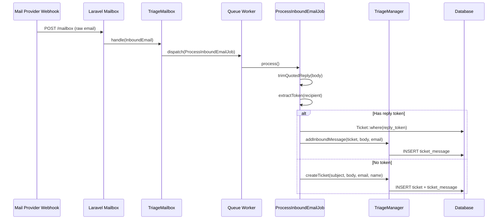
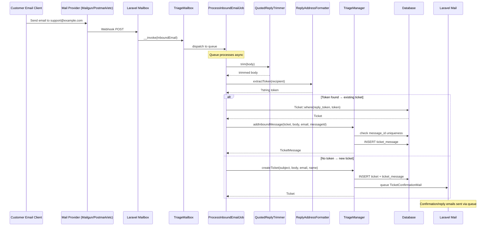

# Plan v1 — Phase 4: Email Integration — Outbound Mail & Inbound Mailbox

I have created the following plan after thorough exploration and analysis of the codebase. Follow the below plan verbatim. Trust the files and references. Do not re-verify what's written in the plan. Explore only when absolutely necessary. First implement all the proposed file changes and then I'll review all the changes together at the end.

---

## Observations

Phase 1 established the Triage package shell with config keys for `mailbox_address`, `reply_to_address`, `from_name`, and `from_address`. Phase 2 built the data layer with `Ticket` (including `reply_token`), `TicketMessage` (with `message_id` uniqueness constraint and `raw_email` column), and `TicketNote` models. Phase 3 implemented the complete SDK in `TriageManager` — including `createTicket()`, `replyToTicket()`, `addInboundMessage()` (with `message_id` deduplication), and all events. The `TriageManager::addInboundMessage()` method already handles deduplication and ticket reopening; this phase focuses on the email transport layer that feeds into and is triggered by the SDK.

---

## Approach

This phase adds the email integration layer. Laravel Mailbox is added as a required Composer dependency for inbound email. A `TriageMailbox` handler receives parsed inbound emails from Mailbox's provider-agnostic webhook, extracts the reply token from the recipient address, and delegates to the SDK via a queued job (`ProcessInboundEmailJob`). Outbound emails are sent via two Mailables: `TicketConfirmationMail` (sent on ticket creation) and `TicketReplyMail` (sent when an agent replies). Event listeners wire the SDK events to the outbound mail dispatch. A `QuotedReplyTrimmer` utility handles best-effort removal of quoted reply threads from inbound email bodies.

---

## - [ ] 1. Composer Dependency

Add `beyondcode/laravel-mailbox` as a required production dependency in `composer.json`:

```
"require": {
    "php": "^8.4",
    "beyondcode/laravel-mailbox": "^1.0",
    "spatie/laravel-package-tools": "^1.16",
    "illuminate/contracts": "^11.0||^12.0"
}
```

This is a required dependency, not optional. The PRD states: "Laravel Mailbox is a required production dependency of Triage, not an optional integration." If mailbox configuration is incomplete (`config('triage.mailbox_address')` is null), inbound email processing is disabled but the rest of the package works.

Note: Verify the latest stable version of `beyondcode/laravel-mailbox` is compatible with Laravel 11 and 12 before requiring it. If the package has been abandoned or doesn't support these versions, document the alternative (e.g., a community fork) and require that instead.

---

## - [ ] 2. Quoted Reply Trimmer

**`src/Support/QuotedReplyTrimmer.php`**

A `final` utility class that strips quoted reply content from inbound email bodies on a best-effort basis.

**Method: `trim(string $body): string`**

Logic flow:
1. If the input contains HTML, first normalize it to plain text using a conservative transformation (`strip_tags`, entity decoding, and whitespace normalization). The normalized plain text is the canonical value that later gets stored on `ticket_messages.body`.
2. Attempt to detect common quoted reply patterns in the plain-text body:
   - Lines starting with `>` characters (standard quoting)
   - Lines beginning with `On ... wrote:` (Gmail, Apple Mail pattern)
   - Lines beginning with `-------- Original Message --------` (Outlook pattern)
   - Lines beginning with `From:` followed by header-like content
3. If a pattern is detected, truncate the body at the first occurrence of the pattern
4. Trim trailing whitespace from the result
5. If no pattern is detected, return the full body unchanged (never drop content)
6. If the result would be empty after trimming (edge case), return the original body instead

The PRD states: "if trimming fails, Triage stores the normalized full body rather than dropping content." This method must never return an empty string if the original was non-empty.

---

## - [ ] 3. Reply Address Formatter

**`src/Support/ReplyAddressFormatter.php`**

A `final` utility class that builds reply-to email addresses with embedded tokens.

**Method: `format(string $replyToken): string`**

1. Read the base reply-to address from `config('triage.reply_to_address')`
2. If null or empty, fall back to `config('triage.from_address')`
3. Split the address at `@` → `[$local, $domain]`
4. Return `"{$local}+triage-{$replyToken}@{$domain}"`

Example: with `reply_to_address` = `support@example.com` and token `abc123def456...`, the result is `support+triage-abc123def456...@example.com`.

**Method: `extractToken(string $emailAddress): ?string`**

1. Match the address against the pattern `/\+triage-([a-f0-9]{32})@/i`
2. If matched, return capture group 1 (the 32-char hex token)
3. If no match, return `null`

This method is used by the inbound mailbox handler to route incoming emails to the correct ticket.

---

## - [ ] 4. Outbound Mailables

Create two Mailable classes in `src/Mail/`.

**`src/Mail/TicketConfirmationMail.php`**

Sent to the submitter when a new ticket is created. Confirms receipt and provides a reply-to address for continued correspondence.

- Extends `Illuminate\Mail\Mailable`
- Implements `ShouldQueue` — all outbound mail is queued
- Constructor: `public function __construct(public readonly Ticket $ticket)`

`envelope(): Envelope`:
- `from`: address from `config('triage.from_address')`, name from `config('triage.from_name')`
- `to`: `$this->ticket->submitter_email`
- `subject`: `"Re: {$this->ticket->subject}"` — using `Re:` prefix so the reply thread looks natural
- `replyTo`: build using `ReplyAddressFormatter::format($this->ticket->reply_token)`

`content(): Content`:
- Uses a Blade markdown view: `triage::emails.ticket-confirmation`
- Data passed: `$ticket` (subject, submitter_name, initial message body)

`attachments(): array`:
- Empty array — no attachments in MVP

**Blade view: `resources/views/emails/ticket-confirmation.blade.php`**

A markdown mailable view that:
1. Greets the submitter by name
2. Confirms the ticket was received, referencing the subject
3. Includes the initial message body as a quote
4. States that replies to this email will be added to the ticket
5. Uses the `mail::message` component from Laravel's mail views

---

**`src/Mail/TicketReplyMail.php`**

Sent to the submitter when an agent replies to their ticket.

- Extends `Illuminate\Mail\Mailable`
- Implements `ShouldQueue`
- Constructor: `public function __construct(public readonly Ticket $ticket, public readonly TicketMessage $message)`

`envelope(): Envelope`:
- `from`: address from `config('triage.from_address')`, name from `config('triage.from_name')`
- `to`: `$this->ticket->submitter_email`
- `subject`: `"Re: {$this->ticket->subject}"`
- `replyTo`: build using `ReplyAddressFormatter::format($this->ticket->reply_token)`

`content(): Content`:
- Uses a Blade markdown view: `triage::emails.ticket-reply`
- Data passed: `$ticket`, `$message` (agent reply body)

`attachments(): array`:
- Empty array

**Blade view: `resources/views/emails/ticket-reply.blade.php`**

A markdown mailable view that:
1. Greets the submitter by name
2. Shows the agent's reply body
3. States that replies to this email will be added to the ticket
4. Uses the `mail::message` component

---

## - [ ] 5. Event Listeners

Create two listeners in `src/Listeners/` that send outbound emails in response to SDK events.

**`src/Listeners/SendTicketConfirmationListener.php`**

- Listens to: `TicketCreated`
- Constructor: none (stateless)
- `handle(TicketCreated $event): void`:
    1. Check that `config('triage.from_address')` is configured. `reply_to_address` is optional because the formatter falls back to `from_address`.
    2. If `from_address` is empty, return early (no outbound mail when the sender address is not configured)
  3. Dispatch `TicketConfirmationMail` via `Mail::to($event->ticket->submitter_email)->queue(new TicketConfirmationMail($event->ticket))`

**`src/Listeners/SendTicketReplyMailListener.php`**

- Listens to: `TicketReplied`
- Constructor: none (stateless)
- `handle(TicketReplied $event): void`:
    1. Same `from_address` configuration check as above
  2. Dispatch `TicketReplyMail` via `Mail::to($event->ticket->submitter_email)->queue(new TicketReplyMail($event->ticket, $event->message))`

---

## - [ ] 6. Register Listeners in Service Provider

Update `TriageServiceProvider::boot()` to register the event-listener mappings.

Add to the `boot()` method after calling `parent::boot()`:

Register using `Event::listen()`:
- `TicketCreated::class` → `SendTicketConfirmationListener::class`
- `TicketReplied::class` → `SendTicketReplyMailListener::class`

This ensures the listeners are active whenever the package is installed, without requiring the host app to register them.

---

## - [ ] 7. Inbound Email Processing Job

**`src/Jobs/ProcessInboundEmailJob.php`**

A queued job that processes a parsed inbound email and delegates to the SDK.

- Implements `ShouldQueue`
- Uses `Dispatchable`, `InteractsWithQueue`, `Queueable`, `SerializesModels` traits

**Constructor:**

```
public function __construct(
    public readonly string $senderEmail,
    public readonly string $senderName,
    public readonly string $subject,
    public readonly string $body,
    public readonly ?string $messageId,
    public readonly ?string $rawEmail,
    public readonly ?string $recipientAddress,
)
```

- `$tries`: 3
- `$backoff`: `[10, 60]` — retry after 10 seconds, then 60 seconds

**`handle(TriageManager $triage, ReplyAddressFormatter $formatter, QuotedReplyTrimmer $trimmer): void`**

Logic flow:

1. Trim the inbound body: `$trimmedBody = $trimmer->trim($this->body)`
2. Attempt to extract a reply token from the recipient address: `$token = $formatter->extractToken($this->recipientAddress ?? '')`
3. **If a token is found** — route to existing ticket:
   a. Look up the ticket: `Ticket::where('reply_token', $token)->first()`
   b. If no ticket found for this token, log a warning and return (orphaned reply)
   c. Call `$triage->addInboundMessage($ticket, $trimmedBody, $this->senderEmail, $this->messageId, $this->rawEmail)`
4. **If no token** — create a new ticket:
   a. Call `$triage->createTicket(subject: $this->subject, body: $trimmedBody, submitterEmail: $this->senderEmail, submitterName: $this->senderName)`
   b. If `$this->messageId` is not null since the initial message was already created by `createTicket`, update the first message's `message_id` and `raw_email` fields
5. Return (job complete)

**`failed(Throwable $exception): void`**

1. Log the failure with the sender email, subject, and exception message using `Log::error()`
2. Do not rethrow — let the queue worker handle retries based on `$tries`



---

## - [ ] 8. Inbound Mailbox Handler

**`src/Mailbox/TriageMailbox.php`**

The handler registered with Laravel Mailbox. This is the entry point for all inbound email.

**Registration:**

In `TriageServiceProvider::boot()`, after the parent boot call, register the mailbox handler conditionally:

1. Check `config('triage.mailbox_address')` — if null, skip registration (inbound email disabled)
2. If configured, call `Mailbox::to(config('triage.mailbox_address'), TriageMailbox::class)` to register the handler for emails sent to the configured address

**Class structure:**

- `final class TriageMailbox`
- Invokable: `__invoke(InboundEmail $email, $mailbox): void`

**`__invoke` logic:**

1. Extract sender info from the `InboundEmail`:
   - `$senderEmail = $email->from()` — the sender's email address
   - `$senderName = $email->fromName()` — the sender's display name (fall back to email if empty)
2. Extract subject: `$subject = $email->subject()`
3. Extract body: `$body = $email->text()` — prefer plain text; fall back to `$email->html()` if text is empty (HTML will be converted to plain text by the trimmer)
4. Extract message ID: `$messageId = $email->header('Message-ID')` — may be null
5. Get raw email: `$rawEmail = $email->raw()` — the full raw email payload
6. Get recipient address: parse from `$email->to()` — the address the email was sent to (may contain the reply token)
7. Dispatch `ProcessInboundEmailJob` with all extracted data onto the queue

The handler itself does minimal processing — it extracts data from the `InboundEmail` object and dispatches the job. All logic lives in the job (and ultimately the SDK).

---

## - [ ] 9. Config for Mailbox Registration in Service Provider

Update `TriageServiceProvider::boot()` to conditionally register the mailbox handler:

After calling `parent::boot()` and registering the gate:

1. Check if `config('triage.mailbox_address')` is not null
2. Check if the `BeyondCode\Mailbox\Facades\Mailbox` class exists (guard against mailbox not being installed)
3. If both conditions pass, register: `Mailbox::to(config('triage.mailbox_address'), TriageMailbox::class)`

This ensures:
- If mailbox is not installed or not configured, the package loads without errors
- The rest of the package (SDK, dashboard) works independently of mailbox configuration

---

## - [ ] 10. Tests

### Unit Tests

**`tests/Unit/Support/QuotedReplyTrimmerTest.php`**

- `it returns the body unchanged when no quoted content is detected` — pass a plain message, assert same output
- `it trims lines starting with greater-than signs` — pass a body with `> quoted text` at the end, assert it's removed
- `it trims On ... wrote: patterns` — pass `Original text\n\nOn Mon, Jan 1 wrote:\n> quoted`, assert only `Original text` remains
- `it trims Outlook original message separators` — pass body with `-------- Original Message --------` separator
- `it trims From: header patterns` — pass body ending with `From: someone@example.com`
- `it returns original body when trimming would produce empty string` — pass a body that is entirely quoted, assert the original is returned
- `it trims trailing whitespace` — assert no trailing whitespace/newlines in output

**`tests/Unit/Support/ReplyAddressFormatterTest.php`**

- `it formats a reply-to address with token` — set `reply_to_address` to `support@example.com`, call `format('abc123...')`, assert `support+triage-abc123...@example.com`
- `it falls back to from_address when reply_to_address is null` — set `reply_to_address` to null, `from_address` to `noreply@app.com`, assert `noreply+triage-...@app.com`
- `it extracts a token from a valid reply address` — call `extractToken('support+triage-abc123def456789012345678abcdef01@example.com')`, assert returns the token
- `it returns null for addresses without a triage token` — call with `support@example.com`, assert null
- `it returns null for malformed tokens` — call with `support+triage-short@example.com`, assert null

### Feature Tests

**`tests/Feature/Mail/TicketConfirmationMailTest.php`**

- `it sends a confirmation email when a ticket is created` — use `Mail::fake()`, create a ticket via SDK, assert `TicketConfirmationMail` was queued to the submitter's email
- `it includes the correct reply-to address` — render the mailable, assert the reply-to header contains `+triage-{reply_token}@`
- `it includes the ticket subject in the email subject` — assert the mailable subject is `Re: {ticket subject}`
- `it does not send when no from address is configured` — set `from_address` and `reply_to_address` to null, create a ticket, assert no mail was queued

**`tests/Feature/Mail/TicketReplyMailTest.php`**

- `it sends a reply email when an agent replies` — use `Mail::fake()`, reply to a ticket, assert `TicketReplyMail` was queued
- `it includes the correct reply-to address` — same reply-to token assertion
- `it does not send when no from address is configured` — same null config check

**`tests/Feature/Jobs/ProcessInboundEmailJobTest.php`**

- `it creates a new ticket when no reply token is present` — dispatch the job with no token in the recipient, assert a new ticket exists
- `it appends a message to an existing ticket when reply token matches` — create a ticket, dispatch the job with the ticket's reply token in the recipient, assert a new message on that ticket
- `it deduplicates by message ID` — dispatch the same job twice with the same message ID, assert only one message exists
- `it trims quoted content from the body` — dispatch a job with quoted reply content, assert the stored body is trimmed
- `it logs a warning for orphaned reply tokens` — dispatch with a non-existent token, assert the job completes without error (check logs)
- `it preserves the existing ticket status on inbound message append` — create a resolved ticket, send an inbound message, and assert the message is appended without implicitly changing status
- `it stores raw email payload` — dispatch with a raw email string, assert `raw_email` is persisted

**`tests/Feature/Mailbox/TriageMailboxTest.php`**

- `it registers the mailbox handler when mailbox_address is configured` — set config, boot the provider, assert the handler is registered
- `it does not register when mailbox_address is null` — leave config null, assert no handler registered
- `it does not error when Laravel Mailbox is not installed` — mock the class_exists check, assert no exception

---

## Inbound Email Flow Diagram


