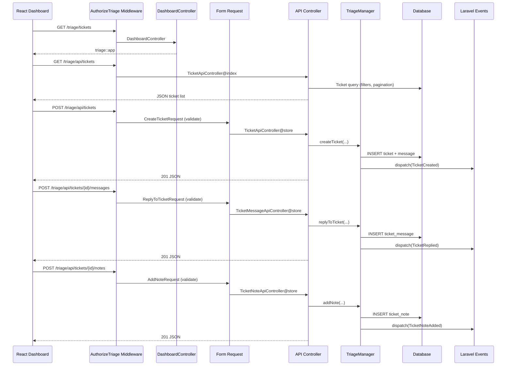

# Plan v1 — Phase 5: HTTP Layer — Blade Shell, API Controllers, Form Requests

I have created the following plan after thorough exploration and analysis of the codebase. Follow the below plan verbatim. Trust the files and references. Do not re-verify what's written in the plan. Explore only when absolutely necessary. First implement all the proposed file changes and then I'll review all the changes together at the end.

---

## Observations

Phase 1 established the package shell with config keys `path` (default `'triage'`) and `middleware` (default `['web']`), the `Triage::auth()` gate callback, and an empty `routes/web.php` stub. Phase 2 built the data layer: `Ticket`, `TicketMessage`, and `TicketNote` models with UUID PKs, scopes, and relationships. Phase 3 implemented the complete `TriageManager` SDK with `createTicket()`, `replyToTicket()`, `addNote()`, `updateTicket()`, `assignTicket()`, `resolveTicket()`, `closeTicket()`, and `addInboundMessage()` — all dispatching events. Phase 4 added the email layer with mailables, mailbox handler, and queued processing. The HTTP layer is now the thin shell that connects the package dashboard to the SDK.

---

## Approach

This phase builds a package-owned dashboard shell plus JSON API.

- A Blade view (`triage::app`) serves the compiled React bundle for `/triage` and any dashboard deep link.
- Thin API controllers delegate entirely to `TriageManager` and return JSON responses.
- A gate middleware protects both shell routes and API routes.
- Form Requests validate API payloads.

This keeps the package portable: the host application only needs Laravel's normal web stack, not a package-specific frontend bridge.

---

## - [ ] 1. Gate Middleware

**`src/Http/Middleware/AuthorizeTriage.php`**

A `final` middleware class that gates access to all Triage dashboard routes. Follows the Horizon authorization pattern.

**`handle(Request $request, Closure $next): Response`**

Logic flow:
1. Check if the user is authenticated: `$request->user()` — if null, abort 403.
2. Check the `triage` gate: `Gate::check('triage', [$request->user()])` — if false, abort 403.
3. Pass to the next middleware: `return $next($request)`.

The gate was registered in Phase 1's `TriageServiceProvider::boot()` using the callback from `TriageManager::resolveAuthCallback()`.

This middleware is not registered globally. It is applied only to the Triage route group in the route registration section below.

---

## - [ ] 2. Dashboard Shell Controller

**`src/Http/Controllers/DashboardController.php`**

A `final` single-action controller that returns the package Blade shell view.

**`__invoke(Request $request): View`**

Behavior:
1. Return `view('triage::app')`.
2. Do not load ticket data in this controller.
3. The frontend fetches all ticket and settings data from JSON endpoints under `/triage/api/*`.

The controller exists solely so `/triage`, `/triage/tickets/*`, and `/triage/settings/*` can resolve to the same frontend shell.

---

## - [ ] 3. Form Requests

Create four Form Request classes in `src/Http/Requests/`. Each uses `declare(strict_types=1)`, is `final`, and uses array-style validation rules.

**`src/Http/Requests/CreateTicketRequest.php`**

`authorize(): bool` — returns `true`.

`rules(): array`

| Field | Rules | Notes |
|---|---|---|
| `subject` | `['required', 'string', 'max:255']` | Ticket subject line |
| `body` | `['required', 'string', 'max:10000']` | Initial message body |
| `submitter_email` | `['required', 'email', 'max:255']` | Submitter's email |
| `submitter_name` | `['required', 'string', 'max:255']` | Submitter's name |
| `priority` | `['sometimes', 'string', Rule::enum(TicketPriority::class)]` | Optional; defaults to Normal if omitted |
| `assignee_id` | `['nullable', 'string', 'max:255']` | Optional agent assignment |

---

**`src/Http/Requests/UpdateTicketRequest.php`**

`authorize(): bool` — returns `true`.

`rules(): array`

| Field | Rules | Notes |
|---|---|---|
| `status` | `['sometimes', 'string', Rule::enum(TicketStatus::class)]` | Optional status change |
| `priority` | `['sometimes', 'string', Rule::enum(TicketPriority::class)]` | Optional priority change |
| `assignee_id` | `['sometimes', 'nullable', 'string', 'max:255']` | Optional reassignment |

At least one field should be present. Add a custom validation rule or `after` hook that fails if none of the supported fields are present.

---

**`src/Http/Requests/ReplyToTicketRequest.php`**

`authorize(): bool` — returns `true`.

`rules(): array`

| Field | Rules | Notes |
|---|---|---|
| `body` | `['required', 'string', 'max:10000']` | Reply message body |

---

**`src/Http/Requests/AddNoteRequest.php`**

`authorize(): bool` — returns `true`.

`rules(): array`

| Field | Rules | Notes |
|---|---|---|
| `body` | `['required', 'string', 'max:10000']` | Note body |

---

## - [ ] 4. API Controllers

Create four controller classes in `src/Http/Controllers/`. All are `final`, use `declare(strict_types=1)`, and follow thin-controller conventions.

### `src/Http/Controllers/TicketApiController.php`

Resource-style controller. Five methods:

#### `index(Request $request): JsonResponse`

1. Build a query on `Ticket` with optional filters from query parameters:
   - `status` → `where('status', $status)`
   - `priority` → `where('priority', $priority)`
   - `assignee_id` → `assignedTo($assigneeId)`
   - `search` → search `subject` and `submitter_email` with `LIKE %term%`
2. Eager-load `messages` count.
3. Order by `created_at` descending.
4. Paginate with 25 per page.
5. Return JSON with paginated ticket data plus the active filters.

#### `show(Ticket $ticket): JsonResponse`

1. Eager-load `messages` (ordered ascending), `notes` (ordered ascending), `submitter`, and `assignee`.
2. Return the serialized ticket as JSON.

#### `store(CreateTicketRequest $request): JsonResponse`

1. Extract validated data.
2. Determine priority: cast provided value to `TicketPriority`; default to `TicketPriority::Normal`.
3. Call `$triage->createTicket(...)`.
4. Return `201` JSON with the new ticket payload and a `location` field pointing to the dashboard URL for that ticket.

#### `update(UpdateTicketRequest $request, Ticket $ticket): JsonResponse`

1. Extract validated data.
2. Build parameters: cast `status` and `priority` when present; pass `assignee_id` as-is.
3. Call `$triage->updateTicket(...)`.
4. Return `200` JSON with the refreshed ticket payload.

Constructor: `public function __construct(private readonly TriageManager $triage)`

---

### `src/Http/Controllers/TicketMessageApiController.php`

Single-method controller for posting replies.

#### `store(ReplyToTicketRequest $request, Ticket $ticket): JsonResponse`

1. Resolve the authenticated user model from the request.
2. Call `$triage->replyToTicket($ticket, body: $request->validated('body'), agent: $request->user())`.
3. Return `201` JSON with the newly created outbound message.

Constructor: `public function __construct(private readonly TriageManager $triage)`

---

### `src/Http/Controllers/TicketNoteApiController.php`

Single-method controller for adding internal notes.

#### `store(AddNoteRequest $request, Ticket $ticket): JsonResponse`

1. Resolve the authenticated user model from the request.
2. Call `$triage->addNote($ticket, body: $request->validated('body'), agent: $request->user())`.
3. Return `201` JSON with the newly created note.

Constructor: `public function __construct(private readonly TriageManager $triage)`

---

### `src/Http/Controllers/SettingsApiController.php`

This controller may be a minimal stub in Phase 5 and will be completed in Phase 7. Create it now so the API surface is established.

Methods:
- `notifications(Request $request): JsonResponse` — returns the authenticated agent's current preference payload.
- `updateNotifications(Request $request): JsonResponse` — validates and persists preference toggles, then returns the saved payload.

Phase 7 fills in the model, validation details, and frontend behavior.

---

## - [ ] 5. Route Registration

**`routes/web.php`**

Replace the empty route file stub with a full shell-plus-API route map.

All routes are within a single group with:
- Prefix: `config('triage.path')` (default `'triage'`)
- Middleware: merge `config('triage.middleware')` (default `['web']`) with `AuthorizeTriage::class`
- Name prefix: `triage.`

### Shell routes

These routes all return the package Blade shell:

| HTTP Method | URI Pattern | Controller | Route Name |
|---|---|---|---|
| `GET` | `/` | `DashboardController` | `triage.dashboard` |
| `GET` | `/{view?}` | `DashboardController` | `triage.dashboard.catchall` |

The catch-all route uses a regex so it matches dashboard deep links such as:
- `/triage/tickets`
- `/triage/tickets/create`
- `/triage/tickets/{ticket}`
- `/triage/settings`
- `/triage/settings/notifications`

It must explicitly exclude `api/*` and mailbox ingress routes.

### API routes

Register these under an `api` prefix inside the same authorized group:

| HTTP Method | URI Pattern | Controller@Method | Route Name |
|---|---|---|---|
| `GET` | `/api/tickets` | `TicketApiController@index` | `triage.api.tickets.index` |
| `POST` | `/api/tickets` | `TicketApiController@store` | `triage.api.tickets.store` |
| `GET` | `/api/tickets/{ticket}` | `TicketApiController@show` | `triage.api.tickets.show` |
| `PATCH` | `/api/tickets/{ticket}` | `TicketApiController@update` | `triage.api.tickets.update` |
| `POST` | `/api/tickets/{ticket}/messages` | `TicketMessageApiController@store` | `triage.api.tickets.messages.store` |
| `POST` | `/api/tickets/{ticket}/notes` | `TicketNoteApiController@store` | `triage.api.tickets.notes.store` |
| `GET` | `/api/settings/notifications` | `SettingsApiController@notifications` | `triage.api.settings.notifications.show` |
| `PATCH` | `/api/settings/notifications` | `SettingsApiController@updateNotifications` | `triage.api.settings.notifications.update` |

The mailbox webhook remains outside this dashboard route group. Laravel Mailbox owns provider-facing ingress.

The `{ticket}` route parameter binds to the `Ticket` model by UUID using implicit model binding on `id`.

---

## - [ ] 6. Update Service Provider Route Registration

Update `TriageServiceProvider::configurePackage()` to use `hasRoutes('web')` as already planned in Phase 1. Verify the route file is loaded correctly.

Do not add any server-side frontend transport dependency for the dashboard. The transport is a standard Blade shell plus JSON endpoints.

---

## - [ ] 7. URL Structure Summary

| URL | Description |
|---|---|
| `/triage` | Dashboard shell root |
| `/triage/tickets` | Dashboard shell for ticket list |
| `/triage/tickets/{ticket}` | Dashboard shell for ticket detail |
| `/triage/tickets/create` | Dashboard shell for manual ticket creation |
| `/triage/settings` | Dashboard shell for settings section |
| `/triage/settings/notifications` | Dashboard shell for notification preferences |
| `/triage/api/tickets` | Ticket list JSON / create ticket JSON |
| `/triage/api/tickets/{ticket}` | Ticket detail JSON / update metadata JSON |
| `/triage/api/tickets/{ticket}/messages` | Add agent reply JSON |
| `/triage/api/tickets/{ticket}/notes` | Add internal note JSON |
| `/triage/api/settings/notifications` | Settings preferences JSON |

---

## - [ ] 8. Tests

### Feature Tests

**`tests/Feature/Http/DashboardControllerTest.php`**

- `it returns the dashboard shell for the root route`
- `it returns the dashboard shell for deep links such as tickets and settings`
- `it denies access to unauthorized users`
- `it denies access to unauthenticated users`

Assertions should verify the response is `200` and renders the `triage::app` view.

---

**`tests/Feature/Http/TicketApiControllerTest.php`**

Uses `RefreshDatabase`. All tests authenticate a user and authorize them via the triage gate.

Because these endpoints return JSON, validation assertions should check `422` JSON responses rather than redirects.

**index:**
- `it returns a successful response for the ticket list`
- `it paginates tickets`
- `it filters tickets by status`
- `it filters tickets by priority`
- `it filters tickets by assignee`
- `it searches tickets by subject`
- `it denies access to unauthorized users`
- `it denies access to unauthenticated users`

**show:**
- `it returns a successful response for a ticket detail`
- `it eager loads messages and notes`
- `it returns 404 for nonexistent ticket`

**store:**
- `it creates a ticket with valid data`
- `it validates required fields`
- `it validates email format`
- `it validates priority enum value`
- `it defaults priority to Normal when not provided`
- `it assigns a ticket when assignee_id is provided`

**update:**
- `it updates ticket status`
- `it updates ticket priority`
- `it updates assignee`
- `it validates status enum value`
- `it validates priority enum value`
- `it rejects empty update`

---

**`tests/Feature/Http/TicketMessageApiControllerTest.php`**

- `it creates a reply on a ticket`
- `it validates body is required`
- `it validates body max length`
- `it denies access to unauthorized users`
- `it sets the authenticated user as author`

---

**`tests/Feature/Http/TicketNoteApiControllerTest.php`**

- `it creates a note on a ticket`
- `it validates body is required`
- `it denies access to unauthorized users`
- `it sets the authenticated user as author`

---

**`tests/Feature/Http/Middleware/AuthorizeTriageTest.php`**

- `it allows access when gate passes`
- `it denies access when gate fails`
- `it denies access to unauthenticated users`
- `it uses the default gate in local environment`
- `it uses the default gate in production environment`

---

## Dashboard → API Flow Diagram

