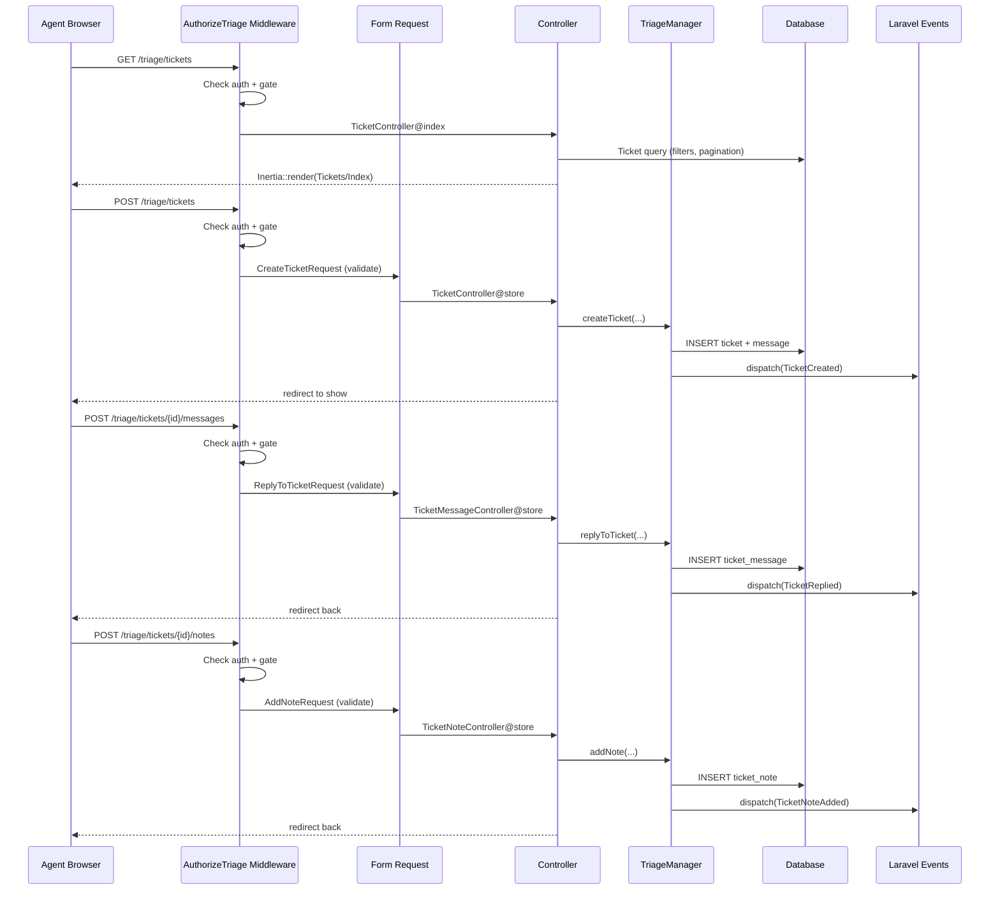

# Plan v1 — Phase 5: HTTP Layer — Controllers, Routes, Form Requests

I have created the following plan after thorough exploration and analysis of the codebase. Follow the below plan verbatim. Trust the files and references. Do not re-verify what's written in the plan. Explore only when absolutely necessary. First implement all the proposed file changes and then I'll review all the changes together at the end.

---

## Observations

Phase 1 established the package shell with config keys `path` (default `'triage'`) and `middleware` (default `['web']`), the `Triage::auth()` gate callback, and an empty `routes/web.php` stub. Phase 2 built the data layer: `Ticket`, `TicketMessage`, `TicketNote` models with UUID PKs, scopes, and relationships. Phase 3 implemented the complete `TriageManager` SDK with `createTicket()`, `replyToTicket()`, `addNote()`, `updateTicket()`, `assignTicket()`, `resolveTicket()`, `closeTicket()`, and `addInboundMessage()` — all dispatching events. Phase 4 added the email layer with mailables, mailbox handler, and queued processing. The HTTP layer is now the thin shell that connects the dashboard SPA to the SDK.

---

## Approach

This phase builds thin Inertia controllers that delegate entirely to `TriageManager`. Per the PRD's "SDK-first" principle, controllers contain zero business logic — they validate input (via Form Requests), call an SDK method, and return an Inertia response. A gate middleware protects all dashboard routes. Form Requests handle validation. Routes are registered in the service provider with the configurable prefix and middleware stack. The controllers return Inertia responses, preparing for Phase 6's React SPA. The Inertia root view is `triage::app` (the Blade shell created in Phase 1).

---

## - [ ] 1. Gate Middleware

**`src/Http/Middleware/AuthorizeTriage.php`**

A `final` middleware class that gates access to all Triage dashboard routes. Follows the Horizon authorization pattern.

**`handle(Request $request, Closure $next): Response`**

Logic flow:
1. Check if the user is authenticated: `$request->user()` — if null, abort 403
2. Check the `triage` gate: `Gate::check('triage', [$request->user()])` — if false, abort 403
3. Pass to the next middleware: `return $next($request)`

The gate was registered in Phase 1's `TriageServiceProvider::boot()` using the callback from `TriageManager::resolveAuthCallback()`.

This middleware is NOT registered globally. It is applied only to the Triage route group in the route registration (section 5).

---

## - [ ] 2. Form Requests

Create four Form Request classes in `src/Http/Requests/`. Each uses `declare(strict_types=1)`, is `final`, and uses array-style validation rules.

**`src/Http/Requests/CreateTicketRequest.php`**

`authorize(): bool` — returns `true` (authorization is handled by the gate middleware; all authenticated+authorized agents can create tickets)

`rules(): array`

| Field | Rules | Notes |
|---|---|---|
| `subject` | `['required', 'string', 'max:255']` | Ticket subject line |
| `body` | `['required', 'string', 'max:10000']` | Initial message body |
| `submitter_email` | `['required', 'email', 'max:255']` | Submitter's email |
| `submitter_name` | `['required', 'string', 'max:255']` | Submitter's name |
| `priority` | `['sometimes', 'string', Rule::enum(TicketPriority::class)]` | Optional; defaults to Normal if omitted |
| `assignee_id` | `['nullable', 'string', 'max:255']` | Optional agent assignment |

---

**`src/Http/Requests/UpdateTicketRequest.php`**

`authorize(): bool` — returns `true`

`rules(): array`

| Field | Rules | Notes |
|---|---|---|
| `status` | `['sometimes', 'string', Rule::enum(TicketStatus::class)]` | Optional status change |
| `priority` | `['sometimes', 'string', Rule::enum(TicketPriority::class)]` | Optional priority change |
| `assignee_id` | `['sometimes', 'string', 'max:255']` | Optional reassignment; omit the field to leave the assignee unchanged |

At least one field should be present. Add a custom validation rule or `after` hook that fails if no fields are present in the request.

---

**`src/Http/Requests/ReplyToTicketRequest.php`**

`authorize(): bool` — returns `true`

`rules(): array`

| Field | Rules | Notes |
|---|---|---|
| `body` | `['required', 'string', 'max:10000']` | Reply message body |

---

**`src/Http/Requests/AddNoteRequest.php`**

`authorize(): bool` — returns `true`

`rules(): array`

| Field | Rules | Notes |
|---|---|---|
| `body` | `['required', 'string', 'max:10000']` | Note body |

---

## - [ ] 3. Controllers

Create three controller classes in `src/Http/Controllers/`. All are `final`, use `declare(strict_types=1)`, and follow thin-controller conventions (no business logic).

**`src/Http/Controllers/TicketController.php`**

Resource-style controller (not invokable). Five methods:

### `create(): Response`

1. Return Inertia render: `Inertia::render('Tickets/Create')`

### `index(Request $request): Response`

1. Build a query on `Ticket` with optional filters from query parameters:
   - `status` (string) → scope: `Ticket::where('status', $status)`
   - `priority` (string) → scope: `Ticket::where('priority', $priority)`
   - `assignee_id` (string) → scope: `Ticket::assignedTo($assigneeId)`
   - `search` (string) → search `subject` and `submitter_email` columns using `LIKE %term%`
2. Eager-load `messages` count (for display)
3. Order by `created_at` descending (newest first)
4. Paginate with 25 per page
5. Return Inertia render: `Inertia::render('Tickets/Index', ['tickets' => $paginated, 'filters' => $request->only(['status', 'priority', 'assignee_id', 'search'])])`

### `show(Ticket $ticket): Response`

1. Eager-load `messages` (ordered ascending), `notes` (ordered ascending), `submitter`, `assignee`
2. Return Inertia render: `Inertia::render('Tickets/Show', ['ticket' => $ticket])`

### `store(CreateTicketRequest $request): RedirectResponse`

1. Extract validated data from the form request
2. Determine priority: if `priority` field is present, cast to `TicketPriority` enum; otherwise default to `TicketPriority::Normal`
3. Call `$triage->createTicket(subject: ..., body: ..., submitterEmail: ..., submitterName: ..., priority: ..., assigneeId: ...)`
4. Redirect to the new ticket's show page: `redirect()->route('triage.tickets.show', $ticket)`

`TriageManager` is injected via constructor: `public function __construct(private readonly TriageManager $triage)`

### `update(UpdateTicketRequest $request, Ticket $ticket): RedirectResponse`

1. Extract validated data
2. Build parameters: cast `status` to `TicketStatus` (if present), `priority` to `TicketPriority` (if present), pass `assignee_id` as-is
3. Call `$triage->updateTicket($ticket, status: ..., priority: ..., assigneeId: ...)`
4. Redirect back to the ticket show page

---

**`src/Http/Controllers/TicketMessageController.php`**

Single-method controller for posting replies.

### `store(ReplyToTicketRequest $request, Ticket $ticket): RedirectResponse`

1. Resolve the authenticated user model from the request
2. Call `$triage->replyToTicket($ticket, body: $request->validated('body'), agent: $request->user())`
3. Redirect back to the ticket show page

Constructor: `public function __construct(private readonly TriageManager $triage)`

---

**`src/Http/Controllers/TicketNoteController.php`**

Single-method controller for adding internal notes.

### `store(AddNoteRequest $request, Ticket $ticket): RedirectResponse`

1. Resolve the authenticated user model from the request
2. Call `$triage->addNote($ticket, body: $request->validated('body'), agent: $request->user())`
3. Redirect back to the ticket show page

Constructor: `public function __construct(private readonly TriageManager $triage)`

---

## - [ ] 4. Inertia Middleware Configuration

For the Inertia integration to work within a package context, the route group needs the Inertia middleware applied. `inertiajs/inertia-laravel` is a package dependency for the dashboard, so this phase should assume the class is present rather than design around a missing install.

**`src/Http/Middleware/HandleTriageInertiaRequests.php`**

A `final` middleware that sets the Inertia root view to the package's Blade shell.

**`handle(Request $request, Closure $next): Response`**

1. Set the Inertia root view: `Inertia::setRootView('triage::app')`
2. Pass to the next middleware: `return $next($request)`

This ensures Inertia renders using the package's own layout, not the host app's layout.

---

## - [ ] 5. Route Registration

**`routes/web.php`**

Replace the empty route file stub (from Phase 1) with the full route definitions.

All routes are within a single group with:
- Prefix: `config('triage.path')` (default `'triage'`)
- Middleware: merge `config('triage.middleware')` (default `['web']`) with `AuthorizeTriage::class` and `HandleTriageInertiaRequests::class`
- Name prefix: `triage.`

| HTTP Method | URI Pattern | Controller@Method | Route Name |
|---|---|---|---|
| `GET` | `/` | `TicketController@index` | `triage.tickets.index` |
| `GET` | `/tickets` | `TicketController@index` | `triage.tickets.index` |
| `GET` | `/tickets/create` | `TicketController@create` | `triage.tickets.create` |
| `POST` | `/tickets` | `TicketController@store` | `triage.tickets.store` |
| `GET` | `/tickets/{ticket}` | `TicketController@show` | `triage.tickets.show` |
| `PATCH` | `/tickets/{ticket}` | `TicketController@update` | `triage.tickets.update` |
| `POST` | `/tickets/{ticket}/messages` | `TicketMessageController@store` | `triage.tickets.messages.store` |
| `POST` | `/tickets/{ticket}/notes` | `TicketNoteController@store` | `triage.tickets.notes.store` |

The root route (`GET /`) redirects or aliases to `tickets.index` so accessing `/triage` directly shows the ticket list.

The mailbox webhook is intentionally not part of this gate-protected dashboard group. Laravel Mailbox owns the provider-facing ingress route; Triage's responsibility in this phase is the authenticated dashboard HTTP surface.

The `{ticket}` route parameter binds to the `Ticket` model by UUID (implicit model binding using the default `id` route key since `getRouteKeyName()` is not overridden — the model uses UUID as the primary key and `id` is the route key by default).

---

## - [ ] 6. Update Service Provider Route Registration

Update `TriageServiceProvider::configurePackage()` to use `hasRoutes('web')` as already planned in Phase 1. Verify the route file is loaded correctly.

Additionally, register `inertiajs/inertia-laravel` as a required Composer dependency for the package. The dashboard is a core feature, so the HTTP layer should not be designed around Inertia being optional.

Add `inertiajs/inertia-laravel` to `composer.json` as a required dependency:

```
"require": {
    "php": "^8.4",
    "beyondcode/laravel-mailbox": "^1.0",
    "inertiajs/inertia-laravel": "^2.0",
    "spatie/laravel-package-tools": "^1.16",
    "illuminate/contracts": "^11.0||^12.0"
}
```

---

## - [ ] 7. URL Structure Summary

| URL | Bound Model | Route Key | Description |
|---|---|---|---|
| `/triage` | — | — | SPA shell / ticket list |
| `/triage/tickets` | — | — | Ticket list (paginated, filtered) |
| `/triage/tickets/{ticket}` | `Ticket` | `id` (UUID) | Ticket detail view |
| `/triage/tickets` (POST) | — | — | Create ticket |
| `/triage/tickets/{ticket}` (PATCH) | `Ticket` | `id` (UUID) | Update ticket metadata |
| `/triage/tickets/{ticket}/messages` (POST) | `Ticket` | `id` (UUID) | Add agent reply |
| `/triage/tickets/{ticket}/notes` (POST) | `Ticket` | `id` (UUID) | Add internal note |

---

## - [ ] 8. Tests

### Feature Tests

**`tests/Feature/Http/TicketControllerTest.php`**

Uses `RefreshDatabase`. All tests authenticate a user and authorize them via the triage gate.

**Setup:** Each test creates a workbench User, authenticates them, and configures `Triage::auth()` to allow access.

Because these routes run through the `web` middleware stack and return Inertia responses, validation assertions should check redirects plus session errors rather than expecting JSON `422` responses.

**index:**
- `it returns a successful response for the ticket list` — GET `/triage/tickets`, assert 200
- `it paginates tickets` — create 30 tickets, GET the list, assert pagination meta is present (25 per page)
- `it filters tickets by status` — create Open and Closed tickets, GET with `?status=open`, assert only Open tickets returned
- `it filters tickets by priority` — create Low and High tickets, GET with `?priority=high`, assert only High returned
- `it filters tickets by assignee` — create assigned and unassigned tickets, GET with `?assignee_id=X`, assert only assigned returned
- `it searches tickets by subject` — create tickets with different subjects, GET with `?search=login`, assert matching tickets returned
- `it denies access to unauthorized users` — don't configure gate, GET tickets, assert 403
- `it denies access to unauthenticated users` — don't authenticate, GET tickets, assert 403

**show:**
- `it returns a successful response for a ticket detail` — create a ticket, GET `/triage/tickets/{id}`, assert 200
- `it eager loads messages and notes` — create ticket with messages and notes, GET detail, assert all are present in the response
- `it returns 404 for nonexistent ticket` — GET with a random UUID, assert 404

**create:**
- `it returns a successful response for the create ticket page` — GET `/triage/tickets/create`, assert 200
- `it denies access to unauthorized users on the create ticket page` — assert 403

**store:**
- `it creates a ticket with valid data` — POST with valid payload, assert redirect and ticket exists in DB
- `it validates required fields` — POST with empty payload, assert redirect with validation errors for subject, body, submitter_email, submitter_name
- `it validates email format` — POST with invalid email, assert redirect with validation errors
- `it validates priority enum value` — POST with `priority=invalid`, assert redirect with validation errors
- `it defaults priority to Normal when not provided` — POST without priority, assert ticket has Normal priority
- `it assigns a ticket when assignee_id is provided` — POST with assignee_id, assert ticket has assignee

**update:**
- `it updates ticket status` — PATCH with `status=resolved`, assert ticket status changed
- `it updates ticket priority` — PATCH with `priority=high`, assert priority changed
- `it updates assignee` — PATCH with `assignee_id`, assert assignee changed
- `it validates status enum value` — PATCH with `status=invalid`, assert redirect with validation errors
- `it validates priority enum value` — PATCH with `priority=invalid`, assert redirect with validation errors
- `it rejects empty update` — PATCH with no fields, assert redirect with validation errors

---

**`tests/Feature/Http/TicketMessageControllerTest.php`**

- `it creates a reply on a ticket` — POST to `/triage/tickets/{id}/messages` with `body`, assert outbound message exists on ticket
- `it validates body is required` — POST with empty body, assert redirect with validation errors
- `it validates body max length` — POST with 10001 chars, assert redirect with validation errors
- `it denies access to unauthorized users` — assert 403
- `it sets the authenticated user as author` — assert reply's `author_id` matches authenticated user

---

**`tests/Feature/Http/TicketNoteControllerTest.php`**

- `it creates a note on a ticket` — POST to `/triage/tickets/{id}/notes` with `body`, assert note exists on ticket
- `it validates body is required` — POST with empty body, assert redirect with validation errors
- `it denies access to unauthorized users` — assert 403
- `it sets the authenticated user as author` — assert note's `author_id` matches authenticated user

---

**`tests/Feature/Http/Middleware/AuthorizeTriageTest.php`**

- `it allows access when gate passes` — configure `Triage::auth()` to return true, make request, assert 200
- `it denies access when gate fails` — configure `Triage::auth()` to return false, make request, assert 403
- `it denies access to unauthenticated users` — make request without auth, assert 403
- `it uses the default gate in local environment` — don't set `Triage::auth()`, set environment to local, assert 200
- `it uses the default gate in production environment` — don't set `Triage::auth()`, set environment to production, assert 403

---

## Controller → SDK Flow Diagram


