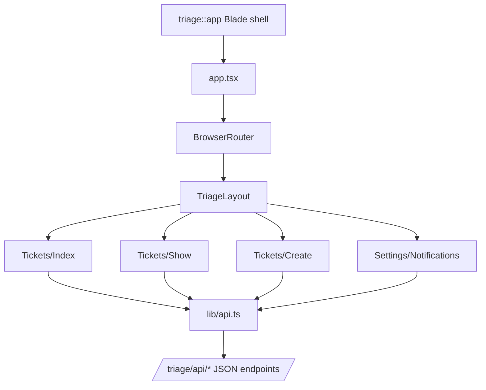

# Plan v1 — Phase 6: Dashboard Frontend — Standalone React SPA

I have created the following plan after thorough exploration and analysis of the codebase. Follow the below plan verbatim. Trust the files and references. Do not re-verify what's written in the plan. Explore only when absolutely necessary. First implement all the proposed file changes and then I'll review all the changes together at the end.

---

## Design References

The following screenshots in `art/` show the intended UI for each page. Use these as the visual reference when implementing components, layouts, and styling decisions.

| Page | Screenshot | Description |
|---|---|---|
| Tickets List | `art/tickets-list.png` | All Tickets view with status tabs, search/filter bar, ticket table with ID, subject, status badge, priority badge, submitter, assignee, and created timestamp columns |
| Ticket Detail | `art/ticket-detail.png` | Ticket detail view with two-column layout: left conversation thread and right metadata sidebar |
| Reports | `art/reports.png` | Reports page with summary stat cards and charts |
| Settings | `art/settings.png` | Settings page with sub-navigation and Notifications sub-page |

### Visual Design Notes

- **Color scheme**: Dark theme throughout — near-black background (`#0d0f14` range), dark card surfaces, white/light-gray text.
- **Sidebar navigation**: Fixed left sidebar (~180px) with app logo/name at top, nav links (All Tickets, My Queue, Reports, Settings), and current agent info pinned to the bottom.
- **Status badge colors**: Open = green outlined pill, Pending = yellow outlined pill, Resolved = blue outlined pill, Closed = gray outlined pill.
- **Priority badge colors**: Urgent = red filled pill, High = orange filled pill, Normal = blue outlined pill, Low = gray outlined pill.
- **Typography**: Clean sans-serif, column headers in small uppercase tracking.
- **Active nav item**: Highlighted with a subtle background fill on the sidebar link.

---

## Observations

Phase 1 established the package shell with a placeholder Blade view at `resources/views/app.blade.php` and a `resources/dist/` directory for compiled assets, plus asset publishing to `public/vendor/triage/`. Phase 2 built the data layer with `Ticket`, `TicketMessage`, and `TicketNote` models. Phase 3 implemented the full `TriageManager` SDK. Phase 4 added email integration. Phase 5 built a package-owned Blade shell and JSON API under `/triage/api/*`. No frontend tooling or React files exist in the package yet.

---

## Approach

This phase builds a standalone React SPA that is shipped inside the package.

- The React app is developed in `resources/js/` with TypeScript, React, and Tailwind CSS.
- Vite compiles the app into `resources/dist/`.
- Host applications publish the compiled assets to `public/vendor/triage/`.
- The package Blade shell loads the bundle and exposes the root element for React.
- Client-side routing is handled by the package frontend, not by server-side page responses.
- All server communication uses package JSON endpoints under `/triage/api/*`.

---

## - [ ] 1. Frontend Tooling Setup

Add frontend development dependencies to `package.json` at the package root. These are dev dependencies only.

| Package | Version | Purpose |
|---|---|---|
| `@types/react` | `^19.0` | TypeScript definitions for React |
| `@types/react-dom` | `^19.0` | TypeScript definitions for React DOM |
| `@vitejs/plugin-react` | `^4.0` | Vite React plugin |
| `@tailwindcss/vite` | `^4.0` | Tailwind CSS Vite plugin |
| `react` | `^19.0` | React core |
| `react-dom` | `^19.0` | React DOM renderer |
| `react-router-dom` | `^7.0` | Client-side routing |
| `tailwindcss` | `^4.0` | Utility-first CSS framework |
| `typescript` | `^5.7` | TypeScript compiler |
| `vite` | `^6.0` | Build tool |

**`tsconfig.json`**

Standard React + TypeScript config:
- `target`: `ES2022`
- `module`: `ESNext`
- `moduleResolution`: `bundler`
- `jsx`: `react-jsx`
- `strict`: `true`
- `baseUrl`: `.`
- `paths`: `{ "@/*": ["resources/js/*"] }`
- `include`: `["resources/js/**/*"]`

**`vite.config.ts`**

Configure Vite to:
1. Use `@vitejs/plugin-react`.
2. Use `@tailwindcss/vite`.
3. Set `build.outDir` to `resources/dist`.
4. Set `build.rollupOptions.input` to `resources/js/app.tsx`.
5. Output fixed filenames for MVP:
   - `assets/app.js`
   - `assets/app.css`

Add npm scripts:
- `dev`: `vite`
- `build`: `vite build`

---

## - [ ] 2. Blade Shell View

**`resources/views/app.blade.php`**

Replace the placeholder from Phase 1 with a complete Blade layout that bootstraps the React app.

The view structure:
1. Standard HTML5 document and responsive meta tags.
2. `<title>` tag: `Triage — {{ config('app.name') }}`.
3. Include published CSS from `/vendor/triage/assets/app.css`.
4. Render a root element such as `

`.
5. Expose minimal runtime config to the frontend, for example:
   - dashboard base path
   - API base path
   - CSRF token
6. Include published JS from `/vendor/triage/assets/app.js`.

This view must remain self-contained. It should not depend on the host application's frontend stack.

---

## - [ ] 3. React App Entry Point

**`resources/js/app.tsx`**

The main entry point that bootstraps React.

Logic:
1. Import React and `createRoot`.
2. Import `BrowserRouter` from `react-router-dom`.
3. Import the global CSS file (`../css/app.css`).
4. Resolve the root DOM element.
5. Read any runtime config exposed by the Blade shell.
6. Render the app with `BrowserRouter`, using the package path as the router basename.

**`resources/css/app.css`**

Import Tailwind CSS with `@import "tailwindcss"`.

---

## - [ ] 4. TypeScript Type Definitions

**`resources/js/types/index.ts`**

Define TypeScript interfaces matching the dashboard JSON payloads.

Core types:
- `Ticket`
- `TicketMessage`
- `TicketNote`
- `User`
- `TicketStatus`
- `TicketPriority`
- `MessageDirection`
- `PaginatedResponse<T>`
- `TicketFilters`
- `AgentPreferences`

These types should model API responses, not server-rendered page props.

---

## - [ ] 5. API Client Utilities

**`resources/js/lib/api.ts`**

Create a small fetch wrapper for package endpoints.

Responsibilities:
1. Prefix requests with the configured `/triage/api` base path.
2. Send `Accept: application/json` and `Content-Type: application/json` when appropriate.
3. Send the CSRF token for mutating requests.
4. Parse JSON responses.
5. Throw a structured error object for non-2xx responses, including validation errors from `422` responses.

Keep this lightweight. No large data-fetching framework is required for MVP.

---

## - [ ] 6. App Routes

**`resources/js/App.tsx`** or **`resources/js/routes.tsx`**

Use `react-router-dom` to define the dashboard route tree.

Required routes:
- `/` → tickets index page
- `/tickets` → tickets index page
- `/tickets/create` → create ticket page
- `/tickets/:ticketId` → ticket detail page
- `/settings` → client-side redirect to `/settings/notifications`
- `/settings/notifications` → notification preferences page

The browser URL should stay meaningful and shareable. The server always responds with the same Blade shell; the frontend resolves the actual screen.

---

## - [ ] 7. Shared Layout Component

**`resources/js/Layouts/TriageLayout.tsx`**

A shared layout wrapper for all Triage pages.

Renders:
1. Fixed left sidebar with app name.
2. Navigation links: All Tickets, My Queue, Reports, Settings.
3. Active link styling based on the current location.
4. Main content area for page content.
5. Current agent avatar, name, and role pinned at the bottom.

Use `NavLink` from `react-router-dom` rather than server-generated links.

---

## - [ ] 8. Tickets Index Page

**`resources/js/Pages/Tickets/Index.tsx`**

Data flow:
1. Read filters from the current query string.
2. Fetch `GET /triage/api/tickets` whenever filters change.
3. Render the ticket table, counts, filters, and pagination.
4. Update the URL query string client-side when filters change.
5. Debounce the search input by ~300ms.

Interactions:
- Status and priority filters update the URL and refetch.
- Search updates the URL and refetches.
- Clicking a row navigates to `/tickets/:ticketId`.
- Pagination buttons update the URL and refetch.

---

## - [ ] 9. Ticket Detail Page

**`resources/js/Pages/Tickets/Show.tsx`**

Data flow:
1. Read `ticketId` from the route.
2. Fetch `GET /triage/api/tickets/{ticket}` on load.
3. Render the conversation thread and metadata sidebar.

Interactions:
- Reply form posts to `/triage/api/tickets/{ticket}/messages`.
- Note form posts to `/triage/api/tickets/{ticket}/notes`.
- Metadata changes patch `/triage/api/tickets/{ticket}`.
- After each successful mutation, update local state or refetch the ticket.

Validation errors should be rendered inline from `422` JSON responses.

---

## - [ ] 10. Create Ticket Page

**`resources/js/Pages/Tickets/Create.tsx`**

Behavior:
1. Render the manual ticket creation form.
2. Submit to `POST /triage/api/tickets`.
3. On success, navigate to `/tickets/:ticketId` using the created ticket returned by the API.
4. Render inline validation errors from `422` responses.

---

## - [ ] 11. Settings Notification Page

**`resources/js/Pages/Settings/Notifications.tsx`**

Behavior:
1. Fetch `GET /triage/api/settings/notifications` on load.
2. Render the settings layout from `art/settings.png`.
3. Manage toggle state locally in React.
4. Submit updates to `PATCH /triage/api/settings/notifications`.
5. Render loading, saving, and validation/error states cleanly.

Phase 7 defines the detailed settings data model and tests.

---

## - [ ] 12. Shared Components

Create reusable React components in `resources/js/Components/`:

- `Badge.tsx` — status / priority pills
- `TicketTable.tsx` — tickets list table
- `Pagination.tsx` — next/previous buttons using router navigation
- `MessageComposer.tsx` — shared form for replies and notes
- `TicketMetaPanel.tsx` — status / priority / assignee controls
- `SettingsNav.tsx` — settings sub-navigation
- `Toggle.tsx` — accessible toggle switch

These components should be framework-agnostic React components. No dependency on server-side page helpers.

---

## - [ ] 13. Frontend Error Handling

The SPA should gracefully handle:
- `403` responses by showing an authorization state or redirecting out of the dashboard.
- `404` responses for deleted or nonexistent tickets.
- `422` validation responses with inline field errors.
- Network failures with a generic retry-friendly error message.

---

## - [ ] 14. Frontend Tests (Optional — documented but not blocking)

Frontend testing is recommended but not strictly required for MVP. If implemented:
- Use Vitest for component/unit tests.
- Use Playwright or Cypress for end-to-end dashboard flows.

Priority coverage:
- ticket list filter behavior
- ticket detail mutations
- create ticket validation
- settings notification save flow

---

## Frontend Architecture Diagram

