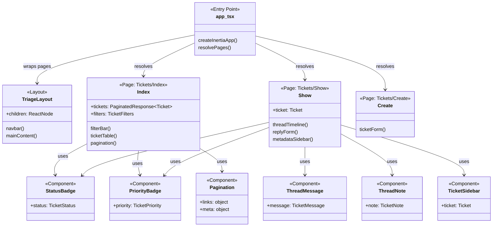
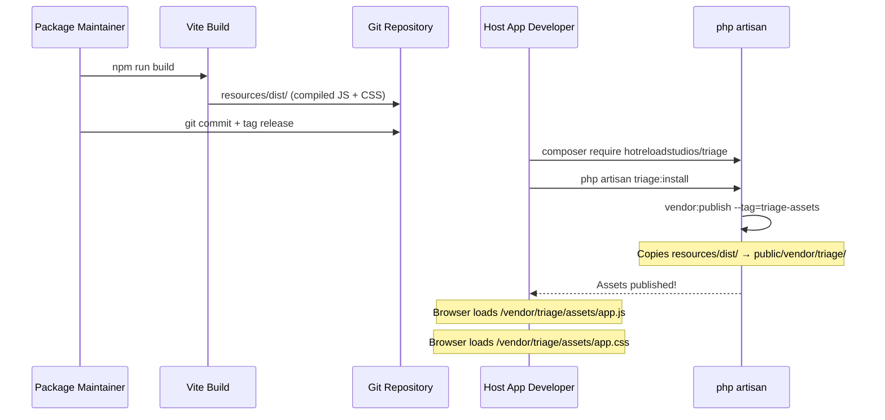

# Plan v1 — Phase 6: Dashboard Frontend — React + Inertia SPA

I have created the following plan after thorough exploration and analysis of the codebase. Follow the below plan verbatim. Trust the files and references. Do not re-verify what's written in the plan. Explore only when absolutely necessary. First implement all the proposed file changes and then I'll review all the changes together at the end.

---

## Design References

The following screenshots in `art/` show the intended UI for each page. Use these as the visual reference when implementing components, layouts, and styling decisions.

| Page | Screenshot | Description |
|---|---|---|
| Tickets List | `art/tickets-list.png` | All Tickets view with status tabs, search/filter bar, ticket table with ID, subject, status badge, priority badge, submitter, assignee, and created timestamp columns |
| Ticket Detail | `art/ticket-detail.png` | Ticket detail view with two-column layout: left conversation thread (inbound customer messages, internal notes with amber background, outbound agent replies) and right metadata sidebar (status/priority dropdowns with colored badges, assignee, submitter, timestamps, ticket ID) |
| Reports | `art/reports.png` | Reports page with summary stat cards (Total Tickets, Open, Resolved, Resolution Rate), Tickets by Status horizontal bar chart, Tickets by Priority horizontal bar chart, and Agent Performance table |
| Settings | `art/settings.png` | Settings page with sub-navigation (Profile, Notifications, Appearance, Security) and Notifications sub-page showing toggle switches for per-event notification preferences |

### Visual Design Notes (from screenshots)

- **Color scheme**: Dark theme throughout — near-black background (`#0d0f14` range), dark card surfaces, white/light-gray text
- **Sidebar navigation**: Fixed left sidebar (~180px) with app logo/name at top, nav links (All Tickets, My Queue, Reports, Settings), and current agent info (avatar + name + role) pinned to the bottom
- **Status badge colors**: Open = green outlined pill, Pending = yellow outlined pill, Resolved = blue outlined pill, Closed = gray outlined pill
- **Priority badge colors**: Urgent = red filled pill, High = orange filled pill, Normal = blue outlined pill, Low = gray outlined pill
- **Internal notes**: Amber/yellow tinted card with amber text color, "Internal Note" label tag next to author name
- **Inbound messages**: White card background, customer avatar with initials, "Customer" tag label
- **Outbound messages**: Slightly darker card, agent avatar with initials, "Outbound" tag with arrow icon
- **Typography**: Clean sans-serif, column headers in small uppercase tracking
- **Active nav item**: Highlighted with a subtle background fill on the sidebar link

---

## Observations

Phase 1 established the package shell with a placeholder Blade view at `resources/views/app.blade.php` and a `resources/dist/` directory for compiled assets, plus asset publishing to `public/vendor/triage/`. Phase 2 built the data layer with Ticket, TicketMessage, and TicketNote models. Phase 3 implemented the full TriageManager SDK. Phase 4 added email integration. Phase 5 built thin Inertia controllers returning responses via `Inertia::render()` with the root view `triage::app`, plus route registration at the configurable prefix. The controllers pass data as Inertia page props. The package requires `inertiajs/inertia-laravel` ^2.0. No frontend tooling or React files exist in the package yet.

---

## Approach

This phase builds the React + Inertia SPA that agents use to manage tickets. The frontend is developed in a `resources/js/` directory with TypeScript, React, and Tailwind CSS. A Vite build pipeline compiles everything into `resources/dist/` — the pre-compiled assets that ship with the package. Host applications do NOT need Node.js, Vite, or any frontend build step; they simply run `php artisan vendor:publish --tag=triage-assets` (or `triage:install`) to copy the compiled files to `public/vendor/triage/`. The Blade shell loads these assets. The SPA uses Inertia.js for page routing (no client-side router like React Router — Inertia handles navigation via server-side controllers from Phase 5).

---

## - [ ] 1. Frontend Tooling Setup

Add frontend development dependencies to a `package.json` at the package root. These are DEV dependencies only — they compile the SPA but do NOT ship to consuming applications.

**`package.json` additions:**

| Package | Version | Purpose |
|---|---|---|
| `@inertiajs/react` | `^2.0` | Inertia.js React adapter |
| `@types/react` | `^19.0` | TypeScript definitions for React |
| `@types/react-dom` | `^19.0` | TypeScript definitions for React DOM |
| `react` | `^19.0` | React core |
| `react-dom` | `^19.0` | React DOM renderer |
| `typescript` | `^5.7` | TypeScript compiler |
| `vite` | `^6.0` | Build tool |
| `@vitejs/plugin-react` | `^4.0` | Vite React plugin |
| `tailwindcss` | `^4.0` | Utility-first CSS framework |
| `@tailwindcss/vite` | `^4.0` | Tailwind CSS Vite plugin |

**`tsconfig.json`:**

Standard React + TypeScript config:
- `target`: `ES2022`
- `module`: `ESNext`
- `moduleResolution`: `bundler`
- `jsx`: `react-jsx`
- `strict`: `true`
- `baseUrl`: `.`
- `paths`: `{ "@/*": ["resources/js/*"] }`
- `include`: `["resources/js/**/*"]`

**`vite.config.ts`:**

Configure Vite to:
1. Use `@vitejs/plugin-react` for React JSX transform
2. Use `@tailwindcss/vite` for Tailwind CSS
3. Set `build.outDir` to `resources/dist`
4. Set `build.rollupOptions.input` to `resources/js/app.tsx`
5. Generate a `manifest.json` in the output for asset versioning
6. Set `build.assetsDir` to `assets` (output to `resources/dist/assets/`)

The build command (`npm run build`) produces:
- `resources/dist/assets/app-{hash}.js`
- `resources/dist/assets/app-{hash}.css`
- `resources/dist/.vite/manifest.json`

Add npm scripts:
- `"dev": "vite"` — development server with HMR (for package development only)
- `"build": "vite build"` — production build

---

## - [ ] 2. Blade Shell View

**`resources/views/app.blade.php`**

Replace the placeholder from Phase 1 with a complete Blade layout that bootstraps the Inertia React app.

The view structure:
1. Standard HTML5 doctype and `<html>` tag with `lang` attribute
2. `<head>`:
   - Meta charset UTF-8
   - Meta viewport for responsive design
   - `<title>` tag: `Triage — {{ config('app.name') }}`
   - Load the compiled CSS from the Vite manifest. Read `public/vendor/triage/.vite/manifest.json` to resolve the hashed CSS filename, and include it as a `<link rel="stylesheet">` tag pointing to `/vendor/triage/assets/app-{hash}.css`
3. `<body>`:
   - The `@inertia` directive — renders the Inertia root `<div id="app">`
   - Load the compiled JS from the manifest. Include as a `<script type="module" src="/vendor/triage/assets/app-{hash}.js">` tag

**Asset resolution strategy:**

Since the assets are pre-compiled and published to `public/vendor/triage/`, the Blade view needs to resolve hashed filenames from the manifest. Create a small helper or inline logic:

1. Read `public_path('vendor/triage/.vite/manifest.json')`
2. JSON decode to get the entry point mapping
3. Extract the CSS and JS file paths from the `resources/js/app.tsx` entry

Alternatively, use a fixed filename approach (no hashing) by configuring Vite to output `app.js` and `app.css` without hashes. This simplifies the Blade view but loses cache-busting. Given this is a package and assets are re-published on version updates, fixed filenames are acceptable for MVP. Configure Vite:

```
build: {
    rollupOptions: {
        output: {
            entryFileNames: 'assets/app.js',
            assetFileNames: 'assets/[name].[ext]',
        }
    }
}
```

With fixed filenames, the Blade view simply references:
- `/vendor/triage/assets/app.css`
- `/vendor/triage/assets/app.js`

---

## - [ ] 3. Inertia App Entry Point

**`resources/js/app.tsx`**

The main entry point that bootstraps Inertia with React.

Logic:
1. Import React and ReactDOM
2. Import the Inertia `createInertiaApp` function from `@inertiajs/react`
3. Import the global CSS file (`../css/app.css`)
4. Call `createInertiaApp()` with:
    - `resolve`: dynamically resolve page components. Use a glob import pattern (`import.meta.glob('./Pages/**/*.tsx')`) to map Inertia page names to React components. The page names match the Inertia render calls from Phase 5 controllers directly (`Tickets/Index`, `Tickets/Show`, `Tickets/Create`).
   - `setup({ el, App, props })`: render `<App {...props} />` into the DOM element using `createRoot(el).render()`

**`resources/css/app.css`**

The root CSS file that imports Tailwind CSS:
- Import `tailwindcss` using `@import "tailwindcss"`

---

## - [ ] 4. TypeScript Type Definitions

**`resources/js/types/index.ts`**

Define TypeScript interfaces matching the Eloquent models serialized as Inertia props.

```
interface Ticket {
    id: string
    subject: string
    status: TicketStatus
    priority: TicketPriority
    submitter_id: string | null
    submitter_name: string
    submitter_email: string
    assignee_id: string | null
    reply_token: string
    created_at: string
    updated_at: string
    messages?: TicketMessage[]
    notes?: TicketNote[]
    messages_count?: number
    submitter?: User | null
    assignee?: User | null
}

interface TicketMessage {
    id: string
    ticket_id: string
    direction: MessageDirection
    author_id: string | null
    body: string
    created_at: string
    updated_at: string
    author?: User | null
}

interface TicketNote {
    id: string
    ticket_id: string
    author_id: string
    body: string
    created_at: string
    updated_at: string
    author?: User | null
}

interface User {
    id: string
    name: string
    email: string
}

type TicketStatus = 'open' | 'pending' | 'resolved' | 'closed'
type TicketPriority = 'low' | 'normal' | 'high' | 'urgent'
type MessageDirection = 'inbound' | 'outbound'

interface PaginatedResponse<T> {
    data: T[]
    links: {
        first: string | null
        last: string | null
        prev: string | null
        next: string | null
    }
    meta: {
        current_page: number
        from: number | null
        last_page: number
        per_page: number
        to: number | null
        total: number
    }
}

interface TicketFilters {
    status?: string
    priority?: string
    assignee_id?: string
    search?: string
}
```

---

## - [ ] 5. Shared Layout Component

**`resources/js/Layouts/TriageLayout.tsx`**

A shared layout wrapper for all Triage pages.

> **Design reference**: All screenshots in `art/` show this layout in use. See the fixed left sidebar with the Triage logo, nav links (All Tickets, My Queue, Reports, Settings), and agent info pinned to the bottom.

**Props:** `{ children: React.ReactNode }`

**Renders:**
1. A fixed left sidebar (~180px) with:
   - App logo/name: "Triage" at the top
   - Navigation links: All Tickets, My Queue, Reports, Settings — with active link highlighted
   - Current agent avatar (initials), name, and role pinned to the bottom
2. A main content area (remaining width) that renders `{children}`
3. Styled with Tailwind CSS: dark theme, near-black background, dark card surfaces, white/light-gray text
4. Responsive: works on desktop and tablet widths

The layout does NOT include host-app navigation. It is self-contained, matching how Horizon and Telescope have their own UI chrome.

---

## - [ ] 6. Ticket List Page

**`resources/js/Pages/Tickets/Index.tsx`**

> **Design reference**: `art/tickets-list.png`

The main ticket list view. This is the first page agents see at `/triage`.

**Inertia Props:**

| Prop | Type | Source |
|---|---|---|
| `tickets` | `PaginatedResponse<Ticket>` | From `TicketController@index` |
| `filters` | `TicketFilters` | Current active filters from query params |

**Components and behavior:**

1. **Filter bar** — A row of filter controls above the table:
   - Status dropdown: All, Open, Pending, Resolved, Closed. Selecting a value navigates via Inertia `router.get()` with the status query param.
   - Priority dropdown: All, Low, Normal, High, Urgent. Same navigation pattern.
   - Search input: Text input that submits a debounced search string via Inertia navigation (300ms debounce). Searches subject and submitter email.
   - Current filters are pre-populated from the `filters` prop.

2. **Ticket table** — A data table with columns:

   | Column | Content | Sortable |
   |---|---|---|
   | Subject | Ticket subject (link to detail page) | No (sorted by created_at) |
   | Status | Badge with color (Open=blue, Pending=yellow, Resolved=green, Closed=gray) | No |
   | Priority | Badge with color (Low=gray, Normal=blue, High=orange, Urgent=red) | No |
   | Submitter | Submitter name + email | No |
   | Assignee | Assignee name or "Unassigned" | No |
   | Created | Relative timestamp (e.g., "2 hours ago") | No |

   Each row is clickable — navigates to the ticket detail page via Inertia link.

3. **Pagination** — Previous/Next buttons using the pagination links from the response. Display "Showing X to Y of Z tickets" text.

4. **Empty state** — When no tickets exist, display a message: "No tickets found" with a prompt to create one.

5. **Create ticket button** — A "New Ticket" button in the top-right that opens the create ticket form (navigates to a create route or opens a modal).

**Layout:** Wrapped in `TriageLayout`.

---

## - [ ] 7. Ticket Detail Page

**`resources/js/Pages/Tickets/Show.tsx`**

> **Design reference**: `art/ticket-detail.png`

The ticket detail view showing the full conversation thread and metadata.

**Inertia Props:**

| Prop | Type | Source |
|---|---|---|
| `ticket` | `Ticket` (with `messages`, `notes`, `submitter`, `assignee` loaded) | From `TicketController@show` |

**Page layout — two columns:**

### Left column (conversation thread, ~70% width):

1. **Thread timeline** — A chronological list interleaving messages and notes, sorted by `created_at` ascending.

   For each **message** (`TicketMessage`):
   - Direction indicator: Inbound messages show submitter avatar/name on the left; outbound show agent avatar/name on the right
   - Body content: rendered as plain text (whitespace preserved)
   - Timestamp: relative format
   - Visual distinction: inbound messages have a light background; outbound have a slightly different tint

   For each **note** (`TicketNote`):
   - Visually distinct: yellow/amber background with a lock icon
   - "Internal note" label
   - Author name and timestamp
   - Body content

2. **Reply form** — At the bottom of the thread:
   - A textarea for the reply body
   - A toggle/tab to switch between "Reply" (sends email to customer) and "Note" (internal only)
   - Submit button: "Send Reply" or "Add Note" depending on the toggle
   - The reply form POSTs to `/triage/tickets/{id}/messages` (reply) or `/triage/tickets/{id}/notes` (note) via Inertia form submission
   - Use `useForm()` hook from `@inertiajs/react` for form state management

### Right column (metadata sidebar, ~30% width):

1. **Status** — Current status as a badge. Dropdown to change status (calls PATCH endpoint via Inertia).
2. **Priority** — Current priority as a badge. Dropdown to change priority.
3. **Assignee** — Current assignee name or "Unassigned". A control to assign/reassign (for MVP, a text input for agent ID; a dropdown of agents requires a user-list endpoint which is out of scope).
4. **Submitter info** — Name, email address.
5. **Created** — Full timestamp.
6. **Updated** — Full timestamp.

Each metadata change triggers an Inertia PATCH request to `/triage/tickets/{id}`.

**Layout:** Wrapped in `TriageLayout`.

---

## - [ ] 8. Create Ticket Page

**`resources/js/Pages/Tickets/Create.tsx`**

> **Design reference**: See the "+ New Ticket" button in `art/tickets-list.png`. No dedicated screenshot exists for this page — follow the dark theme and form conventions established in the other pages.

A full page (or modal, design choice) for creating a new ticket manually.

**Inertia Props:** None (this is a form page).

**Form fields:**

| Field | Type | Required | Notes |
|---|---|---|---|
| Subject | Text input | Yes | Max 255 chars |
| Body | Textarea | Yes | The initial message |
| Submitter Email | Email input | Yes | |
| Submitter Name | Text input | Yes | |
| Priority | Select dropdown | No | Low / Normal / High / Urgent. Default: Normal. |
| Assignee ID | Text input | No | Optional agent assignment |

**Behavior:**
1. Uses `useForm()` from `@inertiajs/react`
2. On submit, POSTs to `/triage/tickets` (the `triage.tickets.store` route)
3. Displays validation errors from the server (Inertia hydrates form errors from the redirect/session response automatically)
4. On success, redirects to the new ticket's detail page (server handles the redirect)

The `GET /tickets/create` route and `TicketController::create()` method belong to Phase 5's HTTP surface. This phase consumes that route and renders the page component it returns.

**Layout:** Wrapped in `TriageLayout`.

---

## - [ ] 9. Shared UI Components

Create reusable React components in `resources/js/Components/`:

**`resources/js/Components/StatusBadge.tsx`**

- Props: `{ status: TicketStatus }`
- Renders a colored badge (Tailwind classes) based on status value
- Colors: Open=blue, Pending=yellow, Resolved=green, Closed=gray

**`resources/js/Components/PriorityBadge.tsx`**

- Props: `{ priority: TicketPriority }`
- Renders a colored badge based on priority value
- Colors: Low=gray, Normal=blue, High=orange, Urgent=red

**`resources/js/Components/Pagination.tsx`**

- Props: `{ links: PaginatedResponse<any>['links'], meta: PaginatedResponse<any>['meta'] }`
- Renders Previous/Next buttons with Inertia links
- Displays "Showing X to Y of Z" text
- Disables buttons when at the first/last page

**`resources/js/Components/ThreadMessage.tsx`**

- Props: `{ message: TicketMessage }`
- Renders a single message in the conversation thread
- Differentiates inbound vs outbound with layout and styling

**`resources/js/Components/ThreadNote.tsx`**

- Props: `{ note: TicketNote }`
- Renders an internal note with distinct yellow/amber styling and lock icon

**`resources/js/Components/TicketSidebar.tsx`**

- Props: `{ ticket: Ticket }`
- Renders the metadata sidebar with status/priority/assignee controls
- Handles PATCH requests for metadata changes via Inertia

---

## - [ ] 10. Build Pipeline & Asset Publishing

**Build process (for package maintainers only):**

1. Run `npm install` in the package root
2. Run `npm run build` — Vite compiles `resources/js/app.tsx` → `resources/dist/`
3. The `resources/dist/` directory is committed to the repository (this is the pre-compiled SPA)
4. When a consuming app runs `php artisan vendor:publish --tag=triage-assets` or `php artisan triage:install`, the contents of `resources/dist/` are copied to `public/vendor/triage/`

**Update `TriageServiceProvider` asset publishing:**

In `boot()`, register the publishable assets:

```php
$this->publishes([
    __DIR__.'/../resources/dist' => public_path('vendor/triage'),
], 'triage-assets');
```

**Update `TriageInstallCommand`:**

The install command (Phase 1) already publishes assets with `--tag=triage-assets`. Verify the path mapping is correct.

**`.gitignore` considerations:**

- `node_modules/` — ignored (dev dependency)
- `resources/dist/` — NOT ignored (committed as pre-compiled assets)

Add to the package's `.gitignore`:

```
node_modules/
```

---

## - [ ] 11. Phase Boundary Note

The create-page controller method and route are part of Phase 5 and should already exist before this frontend phase begins. Phase 6 should not reopen the HTTP design; it should only implement the React page that those routes render.

---

## - [ ] 12. Tests

### Feature Tests

HTTP coverage for the create ticket page belongs in Phase 5 alongside the rest of the route/controller tests.

### Frontend Tests (Optional — documented but not blocking)

Frontend testing for the React SPA is recommended but not strictly required for MVP. If implemented, use Vitest for unit tests and Playwright or Cypress for browser tests.

Recommended test coverage if implemented:

**Component Tests (Vitest):**
- `StatusBadge renders correct color for each status`
- `PriorityBadge renders correct color for each priority`
- `Pagination disables previous button on first page`
- `Pagination disables next button on last page`

**Browser Tests (Playwright / manual verification):**
- Navigate to `/triage`, see the ticket list
- Click a ticket, see the detail page with messages and notes
- Submit a reply, see it appear in the thread
- Add a note, see it appear with yellow styling
- Create a ticket via the form, get redirected to the detail page
- Filter tickets by status, see the list update
- Search tickets, see matching results
- Change ticket status from the sidebar, see badge update
- Try accessing `/triage` when unauthorized, see 403

These browser tests are documented for manual QA or future automation. They do NOT need to be automated in the initial implementation.

---

## Frontend Architecture Diagram



---

## Asset Distribution Diagram


